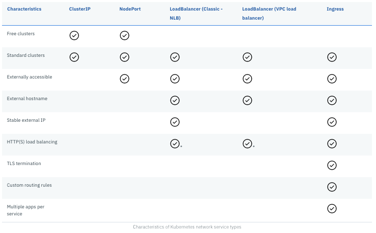

# Lab01 - Services and ClusterIP

## Create a Service

Deploy the `v1/guestbook` application,
```
$ cd v1
$ kubectl create -f guestbook-deployment.yaml
deployment.apps/guestbook-v1 created
```

An application is a set of Pods that is exposed by a Service. When you create a Deployment object for the guestbook application, the containers running in pods cannot yet be accessed. When a Pod is deployed to a worker node, it is assigned a `private IP address` in the 172.30.0.0/16 range. Worker nodes and pods can securely communicate on the private network by using private IP addresses. However, Kubernetes creates and destroys Pods dynamically, which means that the location of the Pods changes dynamically. When a Pod is destroyed or a worker node needs to be re-created, a new private IP address is assigned. You can use built-in Kubernetes `service discovery` to expose Pods as a Service. A Service is an abstraction that defines a logical set of Pods and a policy to access the Pods. Kubernetes provides a single DNS name for a set of Pods and can load balance across Pods.

The [Kubernetes API v1.18](https://kubernetes.io/docs/reference/generated/kubernetes-api/v1.18) lists the following API resources for `Service API`:
- Endpoints, core/v1,
- EndpointSlice, discovery/v1beta1,
- Ingress, networking/v1beta1,
- IngressClass, networking/v1beta1,
- Service, cose/v1.

Let look at the declaration for the `v1/guestbook-service.yaml`,
```
apiVersion: v1
kind: Service
metadata:
  name: guestbook
  labels:
    app: guestbook
spec:
  selector:
    app: guestbook
  ports:
  - port: 3000
    targetPort: http-server
```

The `spec` defines two impotant attributes: `selector` and `ports`. The set of Pods that a Service targets, is determined by the selector and labels. When a Service has no selector, the corresponding `Endpoints` object is not created automatically. This can be useful in cases where you want to define an Endpoint manually, for instance in the case of an external database instance.

The service maps the incoming `port` to a `targetPort`. By default the `targetPort` is set to the same value as the incoming `port` field. A port definition in Pods can have a name, and you can reference these names in the `targetPort` attribute of a Service instead of the port number. In the Service example of the guestbook, the `v1/guestbook-deployment.yaml` file should have the following port defined that the Service references by name,

```
ports:
- name: http-server
  containerPort: 3000
```

This even works for pods available via the same network protocol on different ports. Kubernetes supports multiple port definitions on a Service object. 

The default protocol for Services is TCP, see other [supported protocols](https://kubernetes.io/docs/concepts/services-networking/service/#protocol-support). 

## ServiceTypes

Before you create a Service for the Guestbook application, let's first understand what types of services exist. Kubernetes `ServiceTypes` allow you to specify what kind of Service you want. The default is `ClusterIP`. To expose a Service onto an external IP address, you have to create a ServiceType other than ClusterIP.

ServiceType values and their behaviors are:

- **ClusterIP**: Exposes the Service on a cluster-internal IP. This is the default ServiceType.
- **NodePort**: Exposes the Service on each Node’s IP at a static port (the NodePort). A ClusterIP Service, to which the NodePort Service routes, is automatically created. You’ll be able to contact the NodePort Service, from outside the cluster, by requesting <NodeIP>:<NodePort>.
- **LoadBalancer**: Exposes the Service externally using a cloud provider’s load balancer. NodePort and ClusterIP Services, to which the external load balancer routes, are automatically created.
- **ExternalName**: Maps the Service to the contents of the externalName field (e.g. foo.bar.example.com), by returning a CNAME record.

You can also use `Ingress` in place of `Service` to expose HTTP/HTTPS Services. Ingress however is not a ServiceType, but it acts as the entry point for your cluster and lets you consolidate routing rules into a single resource.

The following image demonstrates how Kubernetes forwards public network traffic through kube-proxy and NodePort, LoadBalancer, or Ingress services in IBM Cloud Kubernetes Service.


The following image shows what features each of the different ServiceTypes supports on IBM Cloud.



## Add a Service to Guestbook

Now you have a thorough understanding of the different ServiceTypes on Kubernetes, it is time to expose the Deployment of the guestbook, using a Service. Create a new file `guestbook-svc.yaml`,

```
$ echo 'apiVersion: v1
kind: Service
metadata:
  name: guestbook
  labels:
    app: guestbook
spec:
  selector:
    app: guestbook
  ports:
  - port: 3000
    targetPort: http-server' > guestbook-svc-tmp.yaml
```

and create the Service object for the guestbook Pods,
```
$ kubectl create -f guestbook-svc-tmp.yaml
service/guestbook created
```

Describe the Service,
```
$ kubectl describe svc guestbook
Name:              guestbook
Namespace:         default
Labels:            app=guestbook
Annotations:       <none>
Selector:          app=guestbook
Type:              ClusterIP
IP:                172.21.146.115
Port:              <unset>  3000/TCP
TargetPort:        http-server/TCP
Endpoints:         172.30.63.95:3000,172.30.63.96:3000,172.30.89.213:3000
Session Affinity:  None
Events:            <none>
```

You see that Kubernetes by default creates a Service of type `ClusterIP`. The service is now available and discoverable, but only within the cluster.

Get the endpoints that were created as part of the Service,
```
% kubectl get endpoints
NAME         ENDPOINTS                                               AGE
guestbook    172.30.228.207:3000,172.30.55.3:3000,172.30.55.4:3000   98s
kubernetes   172.20.0.1:2040                                         57m
```

## Endpoints

You can define a Service without a Pod selector to abstract other kinds of backends than Pods. When a Service has no selector, the corresponding Endpoints object is not created automatically. You can manually map the Service to a network address and port by adding an Endpoints object manually.

```
apiVersion: v1
kind: Endpoints
metadata:
  name: my-database-svc
subsets:
  - addresses:
      - ip: 192.0.2.42
    ports:
      - port: 9376
```

This example Endpoints object maps the Service object to a database on 192.0.2.42:9376.

An [ExternalName Service](https://kubernetes.io/docs/concepts/services-networking/service/#externalname) is a special case of Service that does not have selectors and uses DNS names instead. 

```
apiVersion: v1
kind: Service
metadata:
  name: my-database-svc
  namespace: prod
spec:
  type: ExternalName
  externalName: my.database.example.com
```

When looking up the host `my-database-svc.prod.svc.cluster.local`, the cluster DNS Service returns a CNAME record with the value `my.database.example.com`.

## Kubernetes Networking

To learn more in-depth background information about Kubernetes Networking, go [here](README2.md). Otherwise, go to [Lab02](../Lab02/README.md) to learn more about the ServiceType NodePort.

## Resources

- [Choosing an app exposure service](https://cloud.ibm.com/docs/containers?topic=containers-cs_network_planning)
- [ExternalName Service](https://kubernetes.io/docs/concepts/services-networking/service/#externalname)
- [supported protocols](https://kubernetes.io/docs/concepts/services-networking/service/#protocol-support)