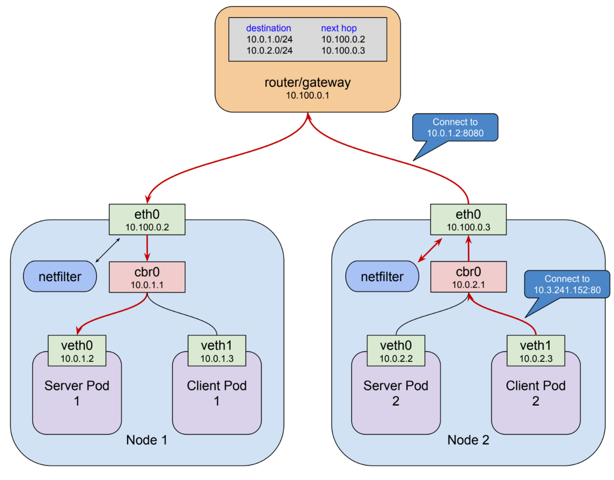

# Lab01 - Extra

## Kubernetes Networking

The services network is implemented by a kubernetes component called kube-proxy collaborating with a linux kernel module called netfilter to trap and reroute traffic sent to the cluster IP so that it is sent to a healthy pod instead

Connections and requests operate at OSI layer 4 (tcp) or layer 7 (http, rpc, etc). Netfilter rules are routing rules, and they operate on IP packets at layer 3. All routers, including netfilter, make routing decisions based more or less solely on information contained in the packet; generally where it is from and where it is going. So to describe this behavior in layer 3 terms: each packet destined for the service at10.3.241.152:80 that arrives at a node’s eth0 interface is processed by netfilter, matches the rules established for our service, and is forwarded to the IP of a healthy pod.



External clients that call into our pods has to make use of this same routing infrastructure. The cluster IP and port is the “front end”. The cluster IP of a service is only reachable from a node’s ethernet interface. How can we forward traffic from a publicly visible IP endpoint to an IP that is only reachable once the packet is already on a node?

One way is to examine the netfilter rules using the iptables utility. Any packet from anywhere that arrives on the node’s ethernet interface with a destination of 10.3.241.152:80 is going to match and get routed to a pod. So you could give clients the cluster IP or a friendly domain name, and then add a route to get the packets to one of the nodes.

But routers operating on layer 3 packets don’t know healthy services from unhealthy. Kube-proxy’s role is to actively manage netfilter. We can’t easily create a stable static route between the gateway router and the nodes using the service network (cluster IP).

## Kube Proxy

Every node in a Kubernetes cluster runs a kube-proxy. To provide basic load balancing of all TCP and UDP network traffic for services, a local Kubernetes network proxy, kube-proxy, runs as a daemon on each worker node in the kube-system namespace. kube-proxy uses Iptables rules, a Linux kernel feature, to direct requests to the pod behind a service equally, independent of pods' in-cluster IP addresses and the worker node that they are deployed to. Kube-proxy is responsible for implementing a form of virtual IP for Services of type other than ExternalName. Kubernetes relies on proxying to forward inbound traffic to backends. 

Proxy modes:
- User space
- iptables
- IPVS

## Discovering Services

Kubernetes supports 2 primary modes of finding a Service:
- environment variables and 
- DNS.

### Environment Variables

When a Pod is run on a Node, the kubelet adds a set of environment variables for each active Service. It supports both Docker links compatible variables (see makeLinkVariables) and simpler {SVCNAME}_SERVICE_HOST and {SVCNAME}_SERVICE_PORT variables

## DNS

A cluster-aware DNS server, such as CoreDNS, watches the Kubernetes API for new Services and creates a set of DNS records for each one. If DNS has been enabled throughout your cluster then all Pods should automatically be able to resolve Services by their DNS name.

Kubernetes also supports DNS SRV (Service) records for named ports. If the "my-service.my-ns" Service has a port named "http" with the protocol set to TCP, you can do a DNS SRV query for _http._tcp.my-service.my-ns to discover the port number for "http", as well as the IP address.

The Kubernetes DNS server is the only way to access ExternalName Services.

Kubernetes offers a DNS cluster addon, which most of the supported environments enable by default. In Kubernetes version 1.11 and later, CoreDNS is recommended and is installed by default with kubeadm.

To verify if the CoreDNS deployment is available,
```
$ kubectl get deployment -n kube-system | grep dns-autoscaler
coredns-autoscaler                   1/1     1            1           11d

$ kubectl get configmap -n kube-system | grep dns
coredns                              1      11d
coredns-autoscaler                   1      11d
node-local-dns                       1      11d
```
The `node-local-dns` is the `NodeLocal` DNS caching agent for improved cluster DNS performance. `NodeLocal` DNS cache is a beta feature.


Go to [Lab02](../Lab02/README.md) to learn more about ServiceType NodePort.