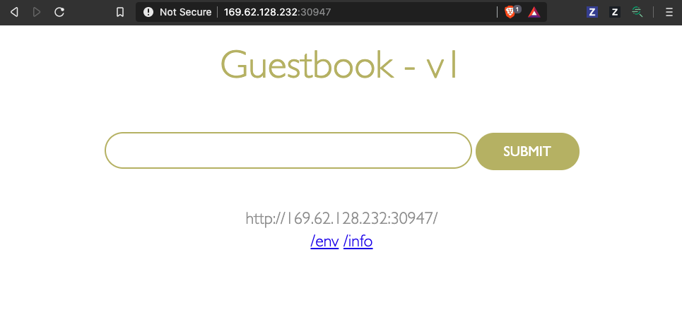

# Lab02 - NodePort

## Pre-requisites

Finish [Lab01](README.md).

## NodePort

To expose a Service onto an external IP address, you have to create a ServiceType other than ClusterIP. Apps inside the cluster can access a pod by using the service's in-cluster IP or by sending a request to the name of the service. When you use the name of the service, kube-proxy looks up the name in the cluster DNS provider and routes the request to the in-cluster IP address of the service. 

To allow external traffic into a kubernetes cluster, you need a `NodePort` ServiceType. If you set the `type` field of Service to `NodePort`, Kubernetes allocates a port from a range specified by `--service-node-port-range` flag (default: 30000-32767). Each node proxies that port (the same port number on every Node) into your Service. 

A gateway router typically sits in front of the cluster, and forwards  packets to the physical ethernet interfaces on the node. The load balancer on the node routes requests to the pods. But if a client wants to connect to our service on port 80 we can’t just send packets directly to that port on the nodes’ interfaces. The network that netfilter is set up to forward packets for is not easily routable from the gateway to the nodes. Therefor, kubernetes creates a bridge between these networks with something called a NodePort.

A service of type NodePort is a ClusterIP service with an additional capability: it is reachable at the public IP address of the node as well as at the assigned cluster IP on the services network. The way this is accomplished is pretty straightforward: when kubernetes creates a NodePort service, `kube-proxy` allocates a port in the range 30000–32767 and opens this port on the `eth0` interface of every node (thus the name `NodePort`). Connections to this port are forwarded to the service’s cluster IP.

Patch the existing Service for guestbook to `type: NodePort`,

```
% kubectl patch svc guestbook -p '{"spec": {"type": "NodePort"}}'
service/guestbook patched
```

Or edit the file `guestbook-svc-tmp.yaml` and set `type: NodePort`,
```
$ vi guestbook-svc-tmp.yaml

apiVersion: v1
kind: Service
metadata:
  name: guestbook
  labels:
    app: guestbook
spec:
  selector:
    app: guestbook
  ports:
  - port: 3000
    targetPort: http-server
  type: NodePort
```

and then apply the changes to the configuration from file,
```
$ kubectl apply -f guestbook-svc-tmp.yaml  
Warning: kubectl apply should be used on resource created by either kubectl create --save-config or kubectl apply
service/guestbook configured
```

Describe the Service,
```
$ kubectl describe svc guestbook
Name:                     guestbook
Namespace:                default
Labels:                   app=guestbook
Annotations:              <none>
Selector:                 app=guestbook
Type:                     NodePort
IP:                       172.21.50.224
Port:                     <unset>  3000/TCP
TargetPort:               http-server/TCP
NodePort:                 <unset>  30947/TCP
Endpoints:                172.30.228.207:3000,172.30.55.3:3000,172.30.55.4:3000
Session Affinity:         None
External Traffic Policy:  Cluster
Events:                   <none>
```

Kubernetes added a NodePort with port value 30947. 

You can now connect to the service via the public IP address of either node in the cluster and traffic gets forwarded to the service, which uses service discovery using the selector. With this piece in place we now have a complete pipeline for load balancing external client requests to all the nodes in the cluster.

Retrieve the Public IP address of the worker nodes,

```
$ ibmcloud ks workers --cluster $CLUSTER_NAME
OK
ID                                                       Public IP        Private IP       Flavor              State    Status   Zone    Version   
kube-bqfo73dd0ajmhsng0e5g-remkohdevik-default-0000072d   169.62.128.236   10.187.222.171   u3c.2x4.encrypted   normal   Ready    dal13   1.16.9_1530   
kube-bqfo73dd0ajmhsng0e5g-remkohdevik-default-000008f0   169.62.128.227   10.187.222.172   u3c.2x4.encrypted   normal   Ready    dal13   1.16.9_1530   
kube-bqfo73dd0ajmhsng0e5g-remkohdevik-default-000009ae   169.62.128.233   10.187.222.168   u3c.2x4.encrypted   normal   Ready    dal13   1.16.9_1530 
```

Open a browser to access your service using the public IP and the NodePort, http://<public IP>:<nodeport value>, e.g. http://169.62.128.236:30947/.



The client connects to the load balancer via a public IP address on the worker node. The load balancer selects a node and connects to it. Kube-proxy receives this connection and forwards it to the service at the cluster IP. At this point the request matches the netfilter rules and gets redirected to the server pod.
