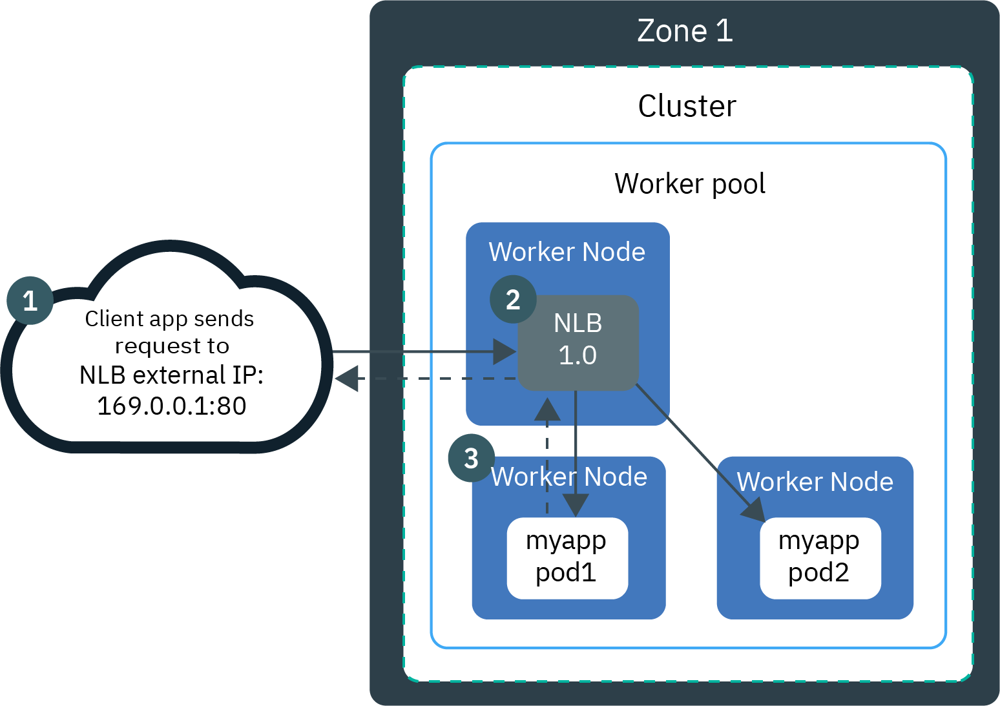

# Lab03 - Loadbalancer and Network Load Balancer (NLB) 1.0

## Pre-requisites

Finish [Lab01](README.md) and [Lab02](README.md).

## LoadBalancer

In the previous two labs, you created a service for the guestbook application with a cluster IP and then added a NodePort to the Service. But you still need a load balancer of some kind in front of the cluster, whether your clients are internal or coming in over the public network. A load balancer acts as a reverse proxy and distributes network or application traffic across a number of servers.

On cloud providers that support external load balancers, setting the `type` field to `LoadBalancer` provisions a load balancer for your Service. The actual creation of the load balancer happens asynchronously with the Service, so you might have to wait until the load balancer has been created.

To use a load balancer for distributing client traffic to the nodes in a cluster we need a public IP address that the clients can connect to, and we need addresses on the nodes themselves to which the load balancer can forward the requests.

A service of type `LoadBalancer` has all the capabilities of a `NodePort` service but also the ability to build out a complete ingress path.

Allocation of an external IP address requires the system to create an external IP address, a forwarding rule, a target proxy, a backend service, and possibly an instance group. Once the IP address has been allocated you can connect to your service through it, assign it a domain name and distribute it to clients.

Services of type `LoadBalancer` have some limitations. You cannot configure the load balancer to terminate https traffic, do virtual hosts or path-based routing, so you can’t use a single load balancer to proxy to multiple services. These limitations led to the addition in version 1.2 of a separate kubernetes resource for configuring load balancers, called an `Ingress` (see next lab). 

Note that the LoadBalancer service type is implemented differently depending on your cluster's infrastructure provider. On IKS (IBM Kubernetes Service), `classic clusters` implement a Network Load Balancer (NLB) 1.0 by default. To set up DSR load balancing with an NLB 2.0 see [here](https://cloud.ibm.com/docs/containers?topic=containers-loadbalancer-v2).

Every standard cluster on IKS is provisioned with four portable public and four portable private IP addresses that you can use to create a layer 4 TCP/UDP Network Load Balancer (NLB) for your app. The portable public and private IP addresses that are assigned to the NLB are permanent and do not change. 

When you create a Kubernetes LoadBalancer service for an app in your IKS cluster, a layer 7 Virtual Private Cloud (VPC) load balancer is automatically created in your VPC outside of your cluster. The VPC load balancer is multizonal and routes requests for your app through the private NodePorts that are automatically opened on your worker nodes. 

## Load Balancing Methods

Before we create a load balancer for the Guestbook application, review the different Load Balancing Methods on IKS:

- `NodePort` exposes the app via a port and public IP address on a worker node.
- `NLB v1.0 + subdomain` uses basic load balancing that exposes the app with an IP address or a subdomain.
- `NLB v2.0 + subdomain`, uses Direct Server Return (DSR) load balancing, which does not change the packets but the destination address, and exposes the app with an IP address or a subdomain, supports SSL termination. Network load balancer (NLB) 2.0 is in beta. To [specify a load balancer 2.0'(https://cloud.ibm.com/docs/containers?topic=containers-loadbalancer-v2#ipvs_single_zone_config) you must add annotation `service.kubernetes.io/ibm-load-balancer-cloud-provider-enable-features: "ipvs"` to the service.
- `Istio + NLB subdomain` uses basic load balancing that exposes the app with a subdomain and uses Istio routing rules.
- `Ingress with public ALB` uses HTTPS load balancing that exposes the app with a subdomain and uses custom routing rules and SSL termination for multiple apps. Customize the ALB routing rules with [annotations](https://cloud.ibm.com/docs/containers?topic=containers-ingress_annotation).
- `Custom Ingress + NLB subdomain` uses HTTPS load balancing with a custom Ingress that exposes the app with the IBM-provided ALB subdomain and uses custom routing rules.

## Create a Network Load Balancer

In the previous lab, you already created a `NodePort` Service. Delete this service first and then create a new `LoadBalancer` Service.

```
% kubectl delete svc guestbook
service "guestbook" deleted
% rm guestbook-svc-tmp.yaml
% kubectl create -f guestbook-service.yaml
service/guestbook created
```

The Service defined in `guestbook-service.yaml` is of type LoadBalancer. If your cluster has more than 1 worker node, a LoadBalancer is created and an external IP address is assigned to access the service.

```
% kubectl get svc guestbook
NAME         TYPE           CLUSTER-IP      EXTERNAL-IP    PORT(S)          AGE
guestbook    LoadBalancer   172.21.0.211    169.48.75.82   3000:30202/TCP   62s
```

Describe the guestbook LoadBalancer Service,
```
% kubectl describe svc guestbook
Name:                     guestbook
Namespace:                default
Labels:                   app=guestbook
Annotations:              <none>
Selector:                 app=guestbook
Type:                     LoadBalancer
IP:                       172.21.0.211
LoadBalancer Ingress:     169.48.75.82
Port:                     <unset>  3000/TCP
TargetPort:               http-server/TCP
NodePort:                 <unset>  30202/TCP
Endpoints:                172.30.63.95:3000,172.30.63.96:3000,172.30.89.213:3000
Session Affinity:         None
External Traffic Policy:  Cluster
Events:
  Type    Reason                Age   From                Message
  ----    ------                ----  ----                -------
  Normal  EnsuringLoadBalancer  95s   service-controller  Ensuring load balancer
  Normal  EnsuredLoadBalancer   94s   service-controller  Ensured load balancer
```

When you create a standard cluster, IKS automatically provisions a portable public subnet and a portable private subnet. 
- The portable public subnet provides 5 usable IP addresses. 1 portable public IP address is used by the default public Ingress ALB. The remaining 4 portable public IP addresses can be used to expose single apps to the internet by creating public network load balancer services, or NLBs.
- The portable private subnet provides 5 usable IP addresses. 1 portable private IP address is used by the default private Ingress ALB. The remaining 4 portable private IP addresses can be used to expose single apps to a private network by creating private load balancer services, or NLBs.

To access the NLB from the internet, you can use the public IP address of your NLB and the assigned port in the format `<IP_address>:<port>`. NodePorts are accessible on every public and private IP address of every worker node within the cluster.

Access the guestbook app in a browser or with Curl,
```
% curl 169.48.75.82:30202
```

The TCP/UDP Network Load Balancer (NLB) 1.0 that was created with ServiceType `LoadBalancer`, uses Iptables, a Linux kernel feature to load balance requests across an app's pods. The image below shows the traffic flow for a single-zone cluster using an NLB v1.0.



1. Client sends a request to the public IP address or the subdomain of the NLB and the assigned port on the worker node. The DNS system service resolves the subdomain to the portable public IP address of the NLB pod on the worker node.
2. The NLB receives the request and forwards it to the private IP address of the app pod over the private network. The source IP address of the request package is changed to the public IP address of the worker node where the NLB pod runs. If multiple app instances are deployed in the cluster, the NLB routes the requests between the app pods.
3. When the app returns a response packet, it uses the IP address of the worker node where the NLB that forwarded the client request exists. The NLB then sends the response packet to the client.

If you would create not 1 but 5 services of type `LoadBalancer`, an error will occur trying to `sync load balancer` and `ensure load balancer` for the fifth load balancer, because no cloud provider IPs are available anymore after 4 IPs were used for the first 4 load balancers,

```
% kubectl describe svc guestbook5  
...
Events:
  Type     Reason                           Age              From                Message
  ----     ------                           ----             ----                -------
  Normal   EnsuringLoadBalancer             2s (x2 over 7s)  service-controller  Ensuring load balancer
  Warning  CreatingCloudLoadBalancerFailed  2s (x2 over 7s)  ibm-cloud-provider  Error on cloud load balancer a1378a01307d5441cad76a736105fea3 for service default/guestbook5 with UID 1378a013-07d5-441c-ad76-a736105fea3f: No cloud provider IPs are available to fulfill the load balancer service request. Add a portable subnet to the cluster and try again. See https://cloud.ibm.com/docs/containers?topic=containers-cs_troubleshoot_network#cs_troubleshoot_network for details.
  Warning  SyncLoadBalancerFailed           2s (x2 over 7s)  service-controller  Error syncing load balancer: failed to ensure load balancer: Error on cloud load balancer a1378a01307d5441cad76a736105fea3 for service default/guestbook5 with UID 1378a013-07d5-441c-ad76-a736105fea3f: No cloud provider IPs are available to fulfill the load balancer service request. Add a portable subnet to the cluster and try again. See https://cloud.ibm.com/docs/containers?topic=containers-cs_troubleshoot_network#cs_troubleshoot_network for details.
  ```

## Ingress Subdomain

By default, IKS created an Ingress subdomain already when you created the cluster. You can also create a new Ingress subdomain or NLB hostname,
```
% kubectl config current-context
% ibmcloud ks nlb-dns create classic -cluster remkohdev-iks116-3x-cluster --ip 169.48.75.82
OK
NLB hostname was created as remkohdev-iks116-3x-clu-2bef1f4b4097001da9502000c44fc2b2-0001.us-south.containers.appdomain.cloud
```

## Resources

- [Components and architecture of an NLB 1.0](https://cloud.ibm.com/docs/containers?topic=containers-loadbalancer-about#v1_planning).
- [Choosing an app exposure service, choosing a deployment pattern for classic clusters](https://cloud.ibm.com/docs/containers?topic=containers-cs_network_planning#pattern_public).
- [Quick start for load balancers](https://cloud.ibm.com/docs/containers?topic=containers-loadbalancer-qs)
- [Classic: Setting up DSR load balancing with an NLB 2.0 (beta)](https://cloud.ibm.com/docs/containers?topic=containers-loadbalancer-v2)