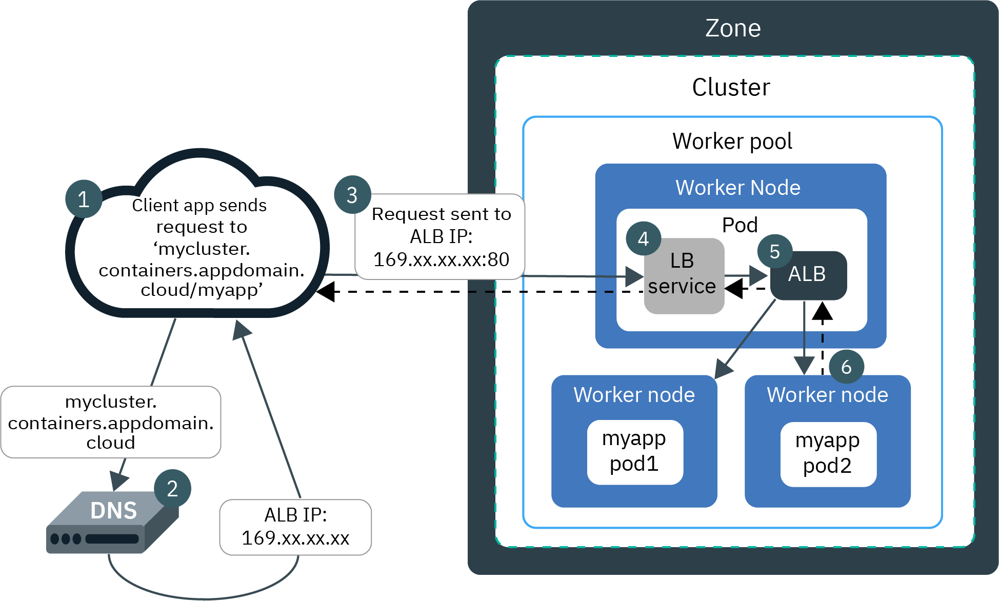

# Lab04 - Ingress and Application Load Balancer (ALB)

## Pre-requisites

Finish [Lab01](../Lab01/README.md), [Lab02](../Lab02/README.md) and [Lab03](../Lab03/README.md).


## Kubernetes Networking

Before we start and create our own Ingress object, let's dive a little bit into the network management on an IBM Cloud Kubernetes (IKS) service.

When you created a Service of type LoadBalancer, a NodePort was created as well. To access the application via the service NodePort, get the public IP address of the worker nodes and the NodePort of the Service.

List the service details,

```
$ kubectl get svc helloworld
NAME    TYPE    CLUSTER-IP    EXTERNAL-IP    PORT(S)    AGE
helloworld   LoadBalancer   172.21.161.255   169.48.67.163   8080:31777/TCP   31m
```

List the worker nodes on the cluster,

```
$ ibmcloud ks worker ls --cluster $CLUSTER_NAME
OK
ID    Public IP    Private IP    Flavor    State    Status    Zone    Version
kube-br9v078d0qi43m0e31n0-remkohdevik-default-0000014b   150.238.93.101   10.187.222.149   b3c.4x16.encrypted   normal   Ready    dal13   1.16.10_1533   
kube-br9v078d0qi43m0e31n0-remkohdevik-default-000002e0   150.238.93.100   10.187.222.146   b3c.4x16.encrypted   normal   Ready    dal13   1.16.10_1533
```

You can access the application via the worker node public IP address and service NodePort at http://150.238.93.101:31777.


When you created the standard cluster in the very beginning, IKS automatically provisioned a portable public subnet and a portable private subnet for the VLAN. You need account permissions to list the subnets,

```
$ ibmcloud ks subnets --provider classic
2422910    10.186.196.112/29    10.186.196.113    2847992    private    br0ktged0io7g05iakcg    dal13
1609575    169.60.156.136/29    169.60.156.137    2847990    public    br0ktged0io7g05iakcg    dal13
```

or list the resources for the cluster,

```
$ ibmcloud ks cluster get --show-resources -c $CLUSTER_NAME
Retrieving cluster remkohdev-iks116-2n-cluster and all its resources...
OK
                                   
Name:                           remkohdev-iks116-2n-cluster   
ID:                             br9v078d0qi43m0e31n0   
State:                          normal   
Created:                        2020-05-31T17:58:58+0000   
Location:                       dal13   
Master URL:                     https://c108.us-south.containers.cloud.ibm.com:30356   
Public Service Endpoint URL:    https://c108.us-south.containers.cloud.ibm.com:30356   
Private Service Endpoint URL:   https://c108.private.us-south.containers.cloud.ibm.com:30356   
Master Location:                Dallas   
Master Status:                  Ready (5 hours ago)   
Master State:                   deployed   
Master Health:                  normal   
Ingress Subdomain:              remkohdev-iks116-294603-2bef1f4b4097001da9502000c44fc2b2-0000.us-south.containers.appdomain.cloud   
Ingress Secret:                 remkohdev-iks116-294603-2bef1f4b4097001da9502000c44fc2b2-0000   
Workers:                        2   
Worker Zones:                   dal13   
Version:                        1.16.10_1533   
Creator:                        remkohdev@us.ibm.com   
Monitoring Dashboard:           -   
Resource Group ID:              fdd290732f7d47909181a189494e2990   
Resource Group Name:            default   

Subnet VLANs
VLAN ID   Subnet CIDR        Public   User-managed   
2847992   10.208.29.72/29    false    false   
2847990   169.48.67.160/29   true     false    
```

The portable public subnet provides 5 usable IP addresses. 1 portable public IP address is used by the default public Ingress ALB. The remaining 4 portable public IP addresses can be used to expose single apps to the internet by creating public network load balancer services, or NLBs.

To list all of the portable IP addresses in the IKS cluster, both used and available, you can retrieve the following `ConfigMap` in the `kube-system` namespace listing the resources of the subnets,

```
$ kubectl get cm ibm-cloud-provider-vlan-ip-config -n kube-system -o yaml

apiVersion: v1
kind: ConfigMap
data:
  cluster_id: br9v078d0qi43m0e31n0
  reserved_private_ip: ""
  reserved_private_vlan_id: ""
  reserved_public_ip: ""
  reserved_public_vlan_id: ""
  vlanipmap.json: |-
    {
      "vlans": [
        {
          "id": "2847992",
          "subnets": [
            {
              "id": "2086403",
              "ips": [
                "10.208.29.74",
                "10.208.29.75",
                "10.208.29.76",
                "10.208.29.77",
                "10.208.29.78"
              ],
              "is_public": false,
              "is_byoip": false,
              "cidr": "10.208.29.72/29"
            }
          ],
          "zone": "dal13",
          "region": "us-south"
        },
        {
          "id": "2847990",
          "subnets": [
            {
              "id": "2387344",
              "ips": [
                "169.48.67.162",
                "169.48.67.163",
                "169.48.67.164",
                "169.48.67.165",
                "169.48.67.166"
              ],
              "is_public": true,
              "is_byoip": false,
              "cidr": "169.48.67.160/29"
            }
          ],
          "zone": "dal13",
          "region": "us-south"
        }
      ],
      "vlan_errors": [],
      "reserved_ips": []
    }
```

One of the public IP addresses on the public VLAN's subnet is assigned to the NLB. List the registered NLB host names and IP addresses in a cluster,

```
$ ibmcloud ks nlb-dns ls --cluster $CLUSTER_NAME

OK
Hostname    IP(
s)    Health Monitor    SSL Cert Status    SSL Cert Secret Name    Secret Namespace    
remkohdev-iks116-294603-2bef1f4b4097001da9502000c44fc2b2-0000.us-south.containers.appdomain.cloud    169.48.67.162    None    created    remkohdev-iks116-294603-2bef1f4b4097001da9502000c44fc2b2-0000    default  
```

You see that the portable IP address `169.48.67.162` is assigned to the NLB. You can access the application via the portable IP address of the NLB and service NodePort at http://169.48.67.162:31777.


## Create an Ingress

`Ingress` is a load balancer and router for container clusters and is a Kubernetes API object that manages external access to the services in a cluster. You can use `Ingress` to expose multiple app services to a public or private network by using a unique public or private route. The Ingress API also supports TLS termination, virtual hosts, and path-based routing.

When you create a standard cluster, an Ingress subdomain is already registered by default for your cluster. The paths to your app services are appended to the public route.

In a standard cluster on IKS, the Ingress `Application Load Balancer (ALB)` is a layer 7 load balancer which implements the `NGINX` Ingress controller. A layer 4 LoadBalancer Service exposes the ALB so that the ALB can receive external requests that come into the cluster. The ALB then routes requests to app pods in your cluster based on distinguishing layer 7 protocol characteristics, such as headers. 



To expose an app using Ingress, you must define an `Ingress` resource. The Ingress resource is a Kubernetes resource that defines the rules for how to route incoming requests for apps. One Ingress resource is required per namespace where you have apps that you want to expose.


## Changes to HelloWorld for Ingress

To access the direct version via the Ingress subdomain and a path rule, I add a path `/hello`.

You need the Ingress Subdomain and Ingress Secret of your cluster to configure your Ingress resource. 

```
$ ibmcloud ks nlb-dns ls --cluster $CLUSTER_NAME
OK
Hostname    IP(s)    Health Monitor    SSL Cert Status    SSL Cert Secret Name    Secret Namespace
remkohdev-iks116-294603-2bef1f4b4097001da9502000c44fc2b2-0000.us-south.containers.appdomain.cloud    169.48.67.162    None    created    remkohdev-iks116-294603-2bef1f4b4097001da9502000c44fc2b2-0000    default 
```

Or,

```
$ ibmcloud ks cluster get --show-resources -c $CLUSTER_NAME
```

Create an Ingress resource using a `rewrite path`. Change the `hosts` and `host` to the `Ingress Subdomain` of your cluster, and change the `secretName` to the value `Ingress Secret` of your cluster. 

```
$ echo 'apiVersion: extensions/v1beta1
kind: Ingress
metadata:
  name: helloworld-ingress
  annotations:
    ingress.bluemix.net/rewrite-path: serviceName=helloworld rewrite=/
spec:
  tls:
  - hosts:
    - <Ingress Subdomain>
    secretName: <Ingress Secret>
  rules:
  - host: <Ingress Subdomain>
    http:
      paths:
      - path: /hello
        backend:
          serviceName: helloworld
          servicePort: 8080' > helloworld-ingress.yaml
```

The above resource will create an access path to helloworld at https://remkohdev-iks116-2n-clu-2bef1f4b4097001da9502000c44fc2b2-0000.us-south.containers.appdomain.cloud/hello. 

You can further [customize Ingres routing with annotations](https://cloud.ibm.com/docs/containers?topic=containers-ingress_annotation) to customize the ALB settings, TLS settings, request and response annocations, service limits, user authentication, or error actions. 

Change the values for the hosts, secretName and host, edit the `helloworld-ingress.yaml` file to make the necessary changes,

```
$ vi helloworld-ingress.yaml
```

Then create the Ingress for helloworld,

```
$ kubectl create -f helloworld-ingress.yaml
ingress.extensions/helloworld-ingress created
```

Try to access the `helloworld` API and the proxy using the Ingress Subdomain with the path to the service,

```
$ HOST=remkohdev-iks116-294603-2bef1f4b4097001da9502000c44fc2b2-0000.us-south.containers.appdomain.cloud

$ curl -L -X POST "http://$HOST/hello/api/messages" -H 'Content-Type: application/json' -d '{ "sender": "remko" }'

{"id":"e6368609-3c64-46ba-98d4-5e84b22a5539","sender":"remko","message":"Hello remko (direct)","host":null}
```

If you instead want to use subdomain paths instead of URI paths, 
```
apiVersion: extensions/v1beta1
kind: Ingress
metadata:
  name: helloworld-ingress
spec:
  tls:
  - hosts:
    - remkohdev-iks116-3x-clu-2bef1f4b4097001da9502000c44fc2b2-0000.us-south.containers.appdomain.cloud
    secretName: remkohdev-iks116-3x-clu-2bef1f4b4097001da9502000c44fc2b2-0000
  rules:
    - host: >-
        hello.remkohdev-iks116-2n-clu-2bef1f4b4097001da9502000c44fc2b2-0000.us-south.containers.appdomain.cloud
      http:
        paths:
          - backend:
              serviceName: helloworld
              servicePort: 8080
    - host: >-
        helloproxy.remkohdev-iks116-2n-clu-2bef1f4b4097001da9502000c44fc2b2-0000.us-south.containers.appdomain.cloud
      http:
        paths:
          - backend:
              serviceName: helloworld-proxy
              servicePort: 8080
```

This Ingress resource will create an access path to app1 at https://hello.remkohdev-iks116-2n-clu-2bef1f4b4097001da9502000c44fc2b2-0000.us-south.containers.appdomain.cloud/


Go to [Lab05](../Lab05/README.md) to learn more about Network Policy and Calico.