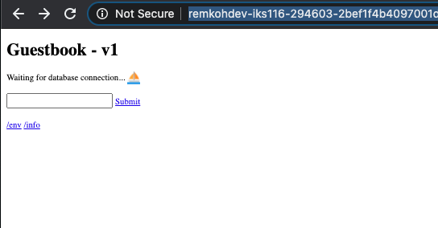

# Lab04 - Ingress and Application Load Balancer (ALB)

## Pre-requisites

Finish [Lab01](../Lab01/README.md), [Lab02](../Lab02/README.md) and [Lab03](../Lab03/README.md).


## Kubernetes Networking

Before we start and create our own Ingress object, let's dive a little bit into the network management on an IBM Cloud Kubernetes (IKS) service.

When you created a Service of type LoadBalancer, a NodePort was created as well. To access the application via the service NodePort, get the public IP address of the worker nodes and the NodePort of the Service.

List the service details,

```
% kubectl get svc guestbook
NAME        TYPE           CLUSTER-IP     EXTERNAL-IP      PORT(S)          AGE
guestbook   LoadBalancer   172.21.88.33   169.60.156.141   3000:30462/TCP   108m
```

List the worker nodes on the cluster,

```
% ibmcloud ks worker ls --cluster $CLUSTER_NAME
OK
ID                                                       Public IP        Private IP       Flavor              State    Status   Zone    Version   
kube-br0ktged0io7g05iakcg-remkohdevik-default-0000012b   169.62.128.232   10.187.222.185   u3c.2x4.encrypted   normal   Ready    dal13   1.16.9_1531   
kube-br0ktged0io7g05iakcg-remkohdevik-default-000002e8   169.62.128.235   10.187.222.188   u3c.2x4.encrypted   normal   Ready    dal13   1.16.9_1531   
```

You can access the application via the worker node public IP address and service NodePort at http://169.60.156.141:30462.


When you created the standard cluster in the very beginning, IKS automatically provisioned a portable public subnet and a portable private subnet for the VLAN. List the subnets,

```
% ibmcloud ks subnets --provider classic | grep br0ktged0io7g05iakcg   
2422910    10.186.196.112/29    10.186.196.113    2847992    private    br0ktged0io7g05iakcg    dal13
1609575    169.60.156.136/29    169.60.156.137    2847990    public    br0ktged0io7g05iakcg    dal13
```

or list the resources for the cluster,

```
% ibmcloud ks cluster get --show-resources -c $CLUSTER_NAME
OK
                                   
Name:                           remkohdev-iks116-2n-cluster   
ID:                             br0ktged0io7g05iakcg   
State:                          normal   
Created:                        2020-05-17T14:50:27+0000   
Location:                       dal13   
Master URL:                     https://c108.us-south.containers.cloud.ibm.com:30805   
Public Service Endpoint URL:    https://c108.us-south.containers.cloud.ibm.com:30805   
Private Service Endpoint URL:   https://c108.private.us-south.containers.cloud.ibm.com:30805   
Master Location:                Dallas   
Master Status:                  Ready (6 hours ago)   
Master State:                   deployed   
Master Health:                  normal   
Ingress Subdomain:              remkohdev-iks116-2n-clu-2bef1f4b4097001da9502000c44fc2b2-0000.us-south.containers.appdomain.cloud   
Ingress Secret:                 remkohdev-iks116-2n-clu-2bef1f4b4097001da9502000c44fc2b2-0000   
Workers:                        2   
Worker Zones:                   dal13   
Version:                        1.16.9_1529   
Creator:                        remkohdev@us.ibm.com   
Monitoring Dashboard:           -   
Resource Group ID:              fdd290732f7d47909181a189494e2990   
Resource Group Name:            default   

Subnet VLANs
VLAN ID   Subnet CIDR         Public   User-managed   
2847992   10.186.196.112/29   false    false   
2847990   169.60.156.136/29   true     false 
```

The portable public subnet provides 5 usable IP addresses. 1 portable public IP address is used by the default public Ingress ALB. The remaining 4 portable public IP addresses can be used to expose single apps to the internet by creating public network load balancer services, or NLBs.

To list all of the portable IP addresses in the IKS cluster, both used and available, you can retrieve the following `ConfigMap` in the `kube-system` namespace listing the resources of the subnets,
```
% kubectl get cm ibm-cloud-provider-vlan-ip-config -n kube-system -o yaml
...
"vlans": [
  {
    "id": "2847992",
    ...
  },
  {
    "id": "2847990",
    "subnets": [
    {
        "id": "1609575",
        "ips": [
        "169.60.156.138",
        "169.60.156.139",
        "169.60.156.140",
        "169.60.156.141",
        "169.60.156.142"
        ],
        "is_public": true,
        "is_byoip": false,
        "cidr": "169.60.156.136/29"
    }
    ],
    "zone": "dal13",
    "region": "us-south"
  }
]
...
```

One of the public IP addresses on the public VLAN's subnet is assigned to the NLB. List the registered NLB host names and IP addresses in a cluster,

```
% ibmcloud ks nlb-dns ls --cluster $CLUSTER_NAME
OK
Hostname    IP(s)    Health Monitor    SSL Cert Status    SSL Cert Secret    Name    Secret Namespace
remkohdev-iks116-2n-clu-2bef1f4b4097001da9502000c44fc2b2-0000.us-south.containers.appdomain.cloud    169.60.156.138    None    created    remkohdev-iks116-2n-clu-2bef1f4b4097001da9502000c44fc2b2-0000    default 
```

You see that the portable IP address `169.60.156.138` is assigned to the NLB. You can access the application via the portable IP address of the NLB and service NodePort at http://169.60.156.138:30462.

## Create an Ingress

`Ingress` is a load balancer and router for container clusters and is a Kubernetes API object that manages external access to the services in a cluster. You can use `Ingress` to expose multiple app services to a public or private network by using a unique public or private route. The Ingress API also supports TLS termination, virtual hosts, and path-based routing.

When you create a standard cluster, an Ingress subdomain is already registered by default for your cluster. The paths to your app services are appended to the public route.

In a standard cluster on IKS, the Ingress `Application Load Balancer (ALB)` is a layer 7 load balancer which implements the `NGINX` Ingress controller. A layer 4 LoadBalancer Service exposes the ALB so that the ALB can receive external requests that come into the cluster. The ALB then routes requests to app pods in your cluster based on distinguishing layer 7 protocol characteristics, such as headers. 


To expose an app using Ingress, you must define an `Ingress` resource. The Ingress resource is a Kubernetes resource that defines the rules for how to route incoming requests for apps. One Ingress resource is required per namespace where you have apps that you want to expose.

## Changes to Guestbook for Ingress

I want to deploy two versions of the guestbook: version 1 and version 2. To access version 1, I add a path `/guestbook/v1` and to access version 2, I add a path `/guestbook/v2`. In this lab, we will only implement the path to version 1, cause extra changes to the selectors would be required to separate version 1 and version 2 when their services look for the pods to forward requests to, and it is outside the scope of this lab. 

You need the Ingress Subdomain and Ingress Secret of your cluster to configure your Ingress resource. 

```
$ ibmcloud ks cluster get --show-resources -c $CLUSTER_NAME
```

Create an Ingress resource using a `rewrite path`. Change the `hosts` and `host` to the `Ingress Subdomain` of your cluster, and change the `secretName` to the value `Ingress Secret` of your cluster. 
```
$ echo 'apiVersion: extensions/v1beta1
kind: Ingress
metadata:
  name: guestbook-ingress
  annotations:
    ingress.bluemix.net/rewrite-path: >-
      serviceName=guestbook rewrite=/
spec:
  tls:
  - hosts:
    - <your Ingress Subdomain>
    secretName: <your Ingress Secret>
  rules:
  - host: <your Ingress Subdomain>
    http:
      paths:
      - path: /guestbook/v1
        backend:
          serviceName: guestbook
          servicePort: 3000' > guestbook-ingress.yaml
```

The above resource will create an access path to guestbook at https://remkohdev-iks116-2n-clu-2bef1f4b4097001da9502000c44fc2b2-0000.us-south.containers.appdomain.cloud/guestbook/v1. 

You can further [customize Ingres routing with annotations](https://cloud.ibm.com/docs/containers?topic=containers-ingress_annotation) to customize the ALB settings, TLS settings, request and response annocations, service limits, user authentication, or error actions. 

Change the values for the hosts, secretName and host, edit the `guestbook-ingress.yaml` file to make the necessary changes,

```
$ vi guestbook-ingress.yaml
```

Then create the Ingress for guestbook,

```
$ kubectl create -f guestbook-ingress.yaml
ingress.extensions/guestbook-ingress created
```

Try to access the guestbook using the Ingress Subdomain with the path to the service, e.g. http://remkohdev-iks116-294603-2bef1f4b4097001da9502000c44fc2b2-0000.us-south.containers.appdomain.cloud/guestbook/v1.



Note that the style of the guestbook application is now broken. This is because the relative paths to the style resources in the application were not set correctly and these need to be refactored to take reverse proxy paths into account. For the purpose of this lab however, we can ignore this.

If you instead want to use subdomain paths instead of URI paths, 
```
apiVersion: extensions/v1beta1
kind: Ingress
metadata:
  name: guestbook-ingress
spec:
  tls:
  - hosts:
    - remkohdev-iks116-3x-clu-2bef1f4b4097001da9502000c44fc2b2-0000.us-south.containers.appdomain.cloud
    secretName: remkohdev-iks116-3x-clu-2bef1f4b4097001da9502000c44fc2b2-0000
  rules:
    - host: >-
        guestbook-v1.remkohdev-iks116-2n-clu-2bef1f4b4097001da9502000c44fc2b2-0000.us-south.containers.appdomain.cloud
      http:
        paths:
          - backend:
              serviceName: guestbook-v1
              servicePort: 3000
    - host: >-
        guestbook-v2.remkohdev-iks116-2n-clu-2bef1f4b4097001da9502000c44fc2b2-0000.us-south.containers.appdomain.cloud
      http:
        paths:
          - backend:
              serviceName: guestbook-v2
              servicePort: 3000
```
This Ingress resource will create an access path to app1 at https://guestbook-v1.remkohdev-iks116-2n-clu-2bef1f4b4097001da9502000c44fc2b2-0000.us-south.containers.appdomain.cloud/


Go to [Lab05](../Lab05/README.md) to learn more about Network Policy and Calico.