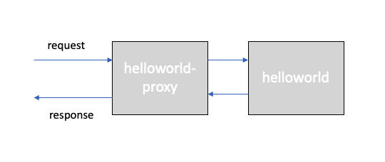

# Network Policy and Calico

## Prerequirements

Finish the [Services](services.md), [ClusterIP](clusterip.md), [NodePort](nodeport.md), [LoadBalancer](loadbalancer.md), [Ingress](ingress-alb.md), and [Route](route.md) labs. This should provide you with:

* Logged in to IBM Cloud account,
* Connected to Kubernetes cluster,
* Guestbook Deployment,
* Guestbook Service of type LoadBalancer,
* An Ingress and Route Ingress controller,

## Network Policies

By default, pods are non-isolated and accept traffic from any source. When defining a pod- or namespace- based NetworkPolicy, labels are used to select pods. If a Pod is matched by selectors in one or more NetworkPolicy objects, then the Pod will accept only connections that are allowed by at least one of those NetworkPolicy's ingress/egress rules. A Pod that is not selected by any NetworkPolicy objects is fully accessible.

Network policies do not conflict, they add up. Thus, order of evaluation does not affect the policy result.

There are four kinds of selectors in an ingress `from` section or egress `to` section:

* podSelector,
* namespaceSelector,
* podSelector and namespaceSelector,
* ipBlock for IP CIDR ranges.

The following example allows traffic from a frontend application to a backend application,

```yaml
apiVersion: networking.k8s.io/v1
kind: NetworkPolicy
metadata:
  name: my-network-policy
  namespace: default
spec:
  podSelector:
    matchLabels:
      role: db
  policyTypes:
  - Ingress
  - Egress
  ingress:
  - from:
    - podSelector:
        matchLabels:
          role: frontend
    ports:
    - protocol: TCP
      port: 6379
  egress:
  - to:
    - podSelector:
        matchLabels:
          role: backend
    ports:
    - protocol: TCP
      port: 5978
```

The following example denies all ingress traffic,

```yaml
apiVersion: networking.k8s.io/v1
kind: NetworkPolicy
metadata:
  name: default-deny-ingress
spec:
  podSelector: {}
  policyTypes:
  - Ingress
```

On IBM Cloud, every Kubernetes Service cluster is set up with a network plug-in called [Calico](https://docs.projectcalico.org/security/calico-network-policy), which includes default network policies to secure the public network interface of every worker node in the cluster. When a Kubernetes network policy is applied, it is automatically converted into a Calico network policy so that Calico can apply it as an `Iptables` rule. Iptables rules serve as a firewall for the worker node to define the characteristics that the network traffic must meet to be forwarded to the targeted resource.

## Create helloworld Proxy

For this tutorial, we will use an additional app called `helloworld-proxy`, which proxies requests to the `helloworld` app.



If you don't have the repository already, clone it to your local machine,

```bash
git clone https://github.com/remkohdev/helloworld.git
cd helloworld
ls -al
```

You should deploy the `helloworld` and `helloworld-proxy` application,

```bash
oc new-project $MY_NS

oc create -f helloworld-deployment.yaml -n $MY_NS
oc create -f helloworld-service-loadbalancer.yaml -n $MY_NS
oc expose service helloworld -n $MY_NS

oc create -f helloworld-proxy-deployment.yaml -n $MY_NS
oc create -f helloworld-proxy-service-loadbalancer.yaml -n $MY_NS
oc expose service helloworld-proxy -n $MY_NS
```

The deployment in your project namespace should now look as follows,

```bash
oc get all -n $MY_NS

$ oc get all -n $MY_NS
NAME                                   READY   STATUS    RESTARTS   AGE
pod/helloworld-6c76f57b9d-76lw9        1/1     Running   0          5h47m
pod/helloworld-6c76f57b9d-jr42j        1/1     Running   0          5h47m
pod/helloworld-6c76f57b9d-qllbz        1/1     Running   0          5h47m
pod/helloworld-proxy-9f89649db-77cc5   1/1     Running   0          13s
pod/helloworld-proxy-9f89649db-fz7wh   1/1     Running   0          13s
pod/helloworld-proxy-9f89649db-ts5zj   1/1     Running   0          13s

NAME                       TYPE           CLUSTER-IP       EXTERNAL-IP     PORT(S)          AGE
service/helloworld         LoadBalancer   172.21.72.153    169.60.24.131   8080:30549/TCP   5h10m
service/helloworld-proxy   LoadBalancer   172.21.115.248   169.60.24.132   8080:31043/TCP   12s

NAME                               READY   UP-TO-DATE   AVAILABLE   AGE
deployment.apps/helloworld         3/3     3            3           5h47m
deployment.apps/helloworld-proxy   3/3     3            3           13s

NAME                                         DESIRED   CURRENT   READY   AGE
replicaset.apps/helloworld-6c76f57b9d        3         3         3       5h47m
replicaset.apps/helloworld-proxy-9f89649db   3         3         3       13s

NAME                                     HOST/PORT                                                                                                              PATH   SERVICES     PORT          TERMINATION   WILDCARD
route.route.openshift.io/example-5w8qv   remkohdev-roks45-2n-clu-2bef1f4b4097001da9502000c44fc2b2-0000.us-south.containers.appdomain.cloud                      /      helloworld   <all>                       None
route.route.openshift.io/helloworld      helloworld-my-apps.remkohdev-roks45-2n-clu-2bef1f4b4097001da9502000c44fc2b2-0000.us-south.containers.appdomain.cloud          helloworld   http-server                 None
```

Get the proxy service details and test the proxy,

```bash
ROUTE=$(oc get route helloworld -n $MY_NS -o json | jq -r '.spec.host')
echo $ROUTE

NODE_PORT=$(oc get svc helloworld -n $MY_NS --output json | jq -r '.spec.ports[0].nodePort' )
echo $NODE_PORT

PROXY_ROUTE=$(oc get route helloworld-proxy -n $MY_NS -o json | jq -r '.spec.host')
echo $PROXY_ROUTE

PROXY_PUBLIC_IP=$(oc get svc helloworld-proxy -n $MY_NS --output json | jq -r '.status.loadBalancer.ingress[0].ip')
echo $PROXY_PUBLIC_IP

PROXY_NODE_PORT=$(oc get svc helloworld-proxy -n $MY_NS --output json | jq -r '.spec.ports[0].nodePort' )
echo $PROXY_NODE_PORT
```

Test the `helloworld-proxy` app, add the `host: helloworld:8080` property in the data object, which tells the `helloworld-proxy` app to proxy the message to the `host` app, and send the request to the `/api/messages` endpoint of our `helloworld` app on port `8080` using the internal DNS for service discovery. Because it is an internal request, the proxy uses the container port rather than the NodePort, which is used for external requests.

```bash
$ curl -L -X POST "http://$ROUTE:$NODE_PORT/api/messages" -H 'Content-Type: application/json' -d '{ "sender": "remko", "host": "helloworld:8080" }'

{"id":"ffb70e2f-34be-480c-9b05-53577119ff75","sender":"remko","message":"Hello remko (direct)","host":"helloworld:8080"}

$ curl -L -X POST "http://$PROXY_ROUTE:$PROXY_NODE_PORT/proxy/api/messages" -H 'Content-Type: application/json' -d '{ "sender": "remko", "host": "helloworld:8080" }'

{"id":"d1d22ad0-02c8-4e17-be07-48ae8b6ce964","sender":"remko","message":"Hello remko (proxy)","host":"helloworld:8080"}
```

The source code for the helloworld application can be found [here](https://github.com/remkohdev/helloworld/blob/master/src/main/java/com/example/helloworld/APIController.java).

## Apply Network Policy - Deny All Traffic

Adopting a zero trust network model is best practice for securing workloads and hosts in your cloud-native strategy.

Define the Network Policy file to deny all traffic,

```bash
echo 'apiVersion: networking.k8s.io/v1
kind: NetworkPolicy
metadata:
  name: helloworld-deny-all
spec:
  podSelector: {}
  policyTypes:
  - Ingress
  - Egress' > helloworld-policy-denyall.yaml
```

Create the Network Policy,

```bash
$ oc create -f helloworld-policy-denyall.yaml -n $MY_NS

networkpolicy.networking.k8s.io/helloworld-deny-all created
```

Test both the `helloworld` and the `helloworld-proxy` apps,

```bash
$ curl -L -X POST "http://$ROUTE:$NODE_PORT/api/messages" -H 'Content-Type: application/json' -d '{ "sender": "remko" }'

curl: (7) Failed connect to helloworld-my-apps.dte-ocp44-t6knp0-915b3b336cabec458a7c7ec2aa7c625f-0000.us-east.containers.appdomain.cloud:30354; Connection timed out

$ curl -L -X POST "http://$PROXY_ROUTE:$PROXY_NODE_PORT/proxy/api/messages" -H 'Content-Type: application/json' -H 'Content-Type: application/json' -d '{ "sender": "remko", "host": "helloworld:8080" }'

curl: (7) Failed connect to helloworld-proxy-my-apps.dte-ocp44-t6knp0-915b3b336cabec458a7c7ec2aa7c625f-0000.us-east.containers.appdomain.cloud:32046; Connection timed out
```

It takes quite a long time before connections time out. All traffic is denied, despite that we have a LoadBalancer services and routes added to each deployment,

```bash
$ oc get svc -n $MY_NS

NAME               TYPE           CLUSTER-IP       EXTERNAL-IP     PORT(S)          AGE
helloworld         LoadBalancer   172.21.72.153    169.60.24.131   8080:30549/TCP   5h34m
helloworld-proxy   LoadBalancer   172.21.115.248   169.60.24.132   8080:31043/TCP   24m

$ oc get routes -n $MY_NS
NAME                       HOST/PORT                                                                                                            PATH   SERVICES           PORT          TERMINATION   WILDCARD
helloworld                 helloworld-my-apps.dte-ocp44-t6knp0-915b3b336cabec458a7c7ec2aa7c625f-0000.us-east.containers.appdomain.cloud                helloworld         http-server                 None
helloworld-proxy           helloworld-proxy-my-apps.dte-ocp44-t6knp0-915b3b336cabec458a7c7ec2aa7c625f-0000.us-east.containers.appdomain.cloud          helloworld-proxy   http-server                 None
```

## Apply Network Policy - Allow Only Traffic to Pod

Let's allow direct ingress traffic to the `helloworld` app on port `8080`, but not allow traffic to the `helloworld-proxy` app.

Define the Network Policy file,

```bash
echo 'apiVersion: networking.k8s.io/v1
kind: NetworkPolicy
metadata:
  name: allow-helloworld
spec:
  policyTypes:
    - Ingress
  podSelector:
    matchLabels:
      app: helloworld
  ingress:
    - {}' > helloworld-allow.yaml
```

Create the Network Policy,

```bash
$ oc create -f helloworld-allow.yaml -n $MY_NS

networkpolicy.networking.k8s.io/allow-helloworld created
```

Review the existing NetworkPolices in the project namespace,

```bash
$ oc get networkpolicies -n $MY_NS

NAME                  POD-SELECTOR     AGE
allow-helloworld      app=helloworld   21s
helloworld-deny-all   <none>           21m
```

Test the `helloworld` and the `helloworld-proxy' apps again,

```bash
$ curl -L -X POST "http://$ROUTE:$NODE_PORT/api/messages" -H 'Content-Type: application/json' -d '{ "sender": "remko" }'

{"id":"12e59a9e-fa21-41f7-a6d5-823a0ca5d2ea","sender":"remko","message":"Hello remko (direct)","host":null}

$ curl -L -X POST "http://$PROXY_ROUTE:$PROXY_NODE_PORT/proxy/api/messages" -H 'Content-Type: application/json' -H 'Content-Type: application/json' -d '{ "sender": "remko", "host": "helloworld:8080" }'

curl: (7) Failed connect to helloworld-proxy-my-apps.dte-ocp44-t6knp0-915b3b336cabec458a7c7ec2aa7c625f-0000.us-east.containers.appdomain.cloud:32046; Connection timed out
```

## Cleanup

Delete the NetworkPolicies in your namespace,

```bash
oc delete  networkpolicy allow-helloworld -n $MY_NS
oc delete networkpolicy helloworld-deny-all -n $MY_NS
```

Delete the previously created resources,

```bash
oc delete deployment helloworld -n $MY_NS
oc delete deployment helloworld-proxy -n $MY_NS
oc delete svc helloworld -n $MY_NS
oc delete svc helloworld-proxy -n $MY_NS
oc delete route helloworld
oc delete route helloworld-proxy
```

Verify all resources are removed,

```bash
$ oc get all -n $MY_NS

No resources found in my-apps namespace.
```

and delete the namespace,

```bash
oc delete namespace $MY_NS
```
