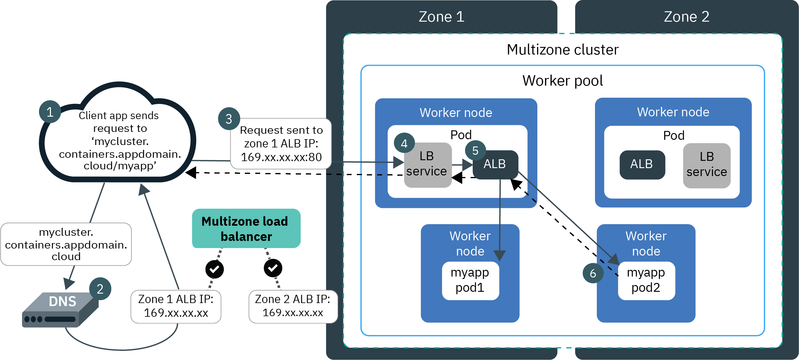

# Ingress and Application Load Balancer (ALB)

## Pre-requisites

Finish the [Services](services.md), [ClusterIP](clusterip.md), [NodePort](nodeport.md) and [LoadBalancer](loadbalancer.md) labs:

* Guestbook Deployment
* Guestbook Service of type LoadBalancer
* Logged in to IBM Cloud account
* Connected to Kubernetes cluster

## Network Administration

When you create a standard cluster in IBM Cloud Kubernetes Service (IKS), a portable public subnet and a portable private subnet for the VLAN are automatically provisioned. You need account permissions to list the subnets,

```
KS_CLUSTER_ID=$(ibmcloud ks cluster get --cluster $KS_CLUSTER_NAME --output json | jq -r '.id')
echo $KS_CLUSTER_ID

ibmcloud ks subnets --provider classic --output json | jq -r '.[] | select ( .properties.bound_cluster=='\"$KS_CLUSTER_ID\"' )'

{
  "id": "2051509",
  "type": "private",
  "vlan_id": "2953608",
  "ip_addresses": [],
  "properties": {
    "cidr": "29",
    "network_identifier": "10.177.211.88",
    "note": "",
    "subnet_type": "secondary_on_vlan",
    "display_label": "10.177.211.88/29",
    "gateway": "10.177.211.89",
    "bound_cluster": "bvmvv8vd0a5t7uq0eii0",
    "datacenter": "dal10"
  }
}
{
  "id": "2506746",
  "type": "public",
  "vlan_id": "2953606",
  "ip_addresses": [],
  "properties": {
    "cidr": "29",
    "network_identifier": "169.61.252.0",
    "note": "",
    "subnet_type": "secondary_on_vlan",
    "display_label": "169.61.252.0/29",
    "gateway": "169.61.252.1",
    "bound_cluster": "bvmvv8vd0a5t7uq0eii0",
    "datacenter": "dal10"
  }
}
```

or list the resources for the cluster,

```
ibmcloud ks cluster get --show-resources -c $KS_CLUSTER_NAME

Retrieving cluster remkohdev-iks118-1n-cluster1 and all its resources...
OK
                                   
Name:                           remkohdev-iks118-1n-cluster1   
ID:                             bvlntf2d0fe4l9hnres0   
State:                          normal   
Status:                         -   
Created:                        2020-12-29T19:10:03+0000   
Location:                       dal10   
Pod Subnet:                     172.30.0.0/16   
Service Subnet:                 172.21.0.0/16   
Master URL:                     https://c111.us-south.containers.cloud.ibm.com:31666   
Public Service Endpoint URL:    https://c111.us-south.containers.cloud.ibm.com:31666   
Private Service Endpoint URL:   -   
Master Location:                Dallas   
Master Status:                  Ready (1 day ago)   
Master State:                   deployed   
Master Health:                  normal   
Ingress Subdomain:              remkohdev-iks118-1n-clu-47d7983a425e05fef831e694b7945b16-0000.us-south.containers.appdomain.cloud   
Ingress Secret:                 remkohdev-iks118-1n-clu-47d7983a425e05fef831e694b7945b16-0000   
Ingress Status:                 healthy   
Ingress Message:                All Ingress components are healthy   
Workers:                        1   
Worker Zones:                   dal10   
Version:                        1.18.13_1535   
Creator:                        -   
Monitoring Dashboard:           -   
Resource Group ID:              68af6383f717459686457a6434c4d19f   
Resource Group Name:            Default   

Subnet VLANs
VLAN ID   Subnet CIDR        Public   User-managed   
3009946   10.176.98.248/29   false    false   
3009944   169.46.16.240/29   true     false 
```

The portable public subnet provides 5 usable IP addresses. 1 portable public IP address is used by the default public Ingress ALB. The remaining 4 portable public IP addresses can be used to expose single apps to the internet by creating public Network Load Balancer (NLB) services.

To list all of the portable IP addresses in the IKS cluster, both used and available, you can retrieve the following `ConfigMap` in the `kube-system` namespace listing the resources of the subnets,

```
kubectl get cm ibm-cloud-provider-vlan-ip-config -n kube-system -o yaml

apiVersion: v1
data:
  cluster_id: bvlntf2d0fe4l9hnres0
  reserved_private_ip: ""
  reserved_private_vlan_id: ""
  reserved_public_ip: ""
  reserved_public_vlan_id: ""
  vlanipmap.json: |-
    {
      "vlans": [
        {
          "id": "3009946",
          "subnets": [
            {
              "id": "2471290",
              "ips": [
                "10.176.98.250",
                "10.176.98.251",
                "10.176.98.252",
                "10.176.98.253",
                "10.176.98.254"
              ],
              "is_public": false,
              "is_byoip": false,
              "cidr": "10.176.98.248/29"
            }
          ],
          "zone": "dal10",
          "region": "us-south"
        },
        {
          "id": "3009944",
          "subnets": [
            {
              "id": "2078743",
              "ips": [
                "169.46.16.242",
                "169.46.16.243",
                "169.46.16.244",
                "169.46.16.245",
                "169.46.16.246"
              ],
              "is_public": true,
              "is_byoip": false,
              "cidr": "169.46.16.240/29"
            }
          ],
          "zone": "dal10",
          "region": "us-south"
        }
      ],
      "vlan_errors": [],
      "reserved_ips": []
    }
kind: ConfigMap
metadata:
  labels:
    addonmanager.kubernetes.io/mode: Reconcile
    kubernetes.io/cluster-service: "true"
  name: ibm-cloud-provider-vlan-ip-config
  namespace: kube-system
  selfLink: /api/v1/namespaces/kube-system/configmaps/ibm-cloud-provider-vlan-ip-config
```

One of the public IP addresses on the public VLAN's subnet is assigned to the NLB. List the registered NLB host names and IP addresses in a cluster,

```
ibmcloud ks nlb-dns ls --cluster $KS_CLUSTER_NAME

OK
Hostname     IP(s)    Health Monitor    SSL Cert Status    SSL Cert Secret Name    Secret Namespace
remkohdev-iks118-1n-clu-47d7983a425e05fef831e694b7945b16-0000.us-south.containers.appdomain.cloud    169.46.16.242    None    created    remkohdev-iks118-1n-clu-47d7983a425e05fef831e694b7945b16-0000    default
```

And retrieve the NodePort via,

```
PORT=$(kubectl get svc helloworld -n $MY_NS --output json | jq -r '.spec.ports[0].nodePort' )
echo $PORT
```

You see that the portable IP address `169.46.16.242` is assigned to the NLB. You can access the application via the portable IP address of the LoadBalancer NLB and service NodePort at http://169.46.16.242:$PORT. But LoadBalancer also has limitations.

## Ingress ALB

`Ingress` is a reverse-proxy load balancer and Kubernetes API object that manages external access to services in a cluster. You can also use `Ingress` to expose multiple app services to a public or private network by using a single unique route. The Ingress API also supports TLS termination, virtual hosts, and path-based routing.

Ingress consists of three components:

* Ingress resources
* Application load balancers (ALBs)
* A load balancer to handle incoming requests across zones. For classic clusters, this component is the multizone load balancer (MZLB) that IBM Cloud Kubernetes Service creates for you. For VPC clusters, this component is the VPC load balancer is created for you in your VPC.

To expose an app with Ingress, you must create a Kubernetes service and register this with Ingress by defining an Ingress resource. One Ingress resource is required per namespace where you have apps that you want to expose. 

The Ingress resource is a Kubernetes resource that defines the rules for how to route incoming requests for apps. The Ingress resource also specifies the path to your app services. When you created a standard IKS cluster, an Ingress subdomain is already registered by default for your cluster. The paths to your app services are appended to the public route.

In a standard cluster on IKS, the Ingress Application Load Balancer (ALB) is a layer 7 (L7) load balancer which implements the `NGINX` Ingress controller. A layer 4 (L4) LoadBalancer service exposes the ALB so that the ALB can receive external requests to your cluster. The ALB routes requests to app pods in your cluster based on distinguishing L7 protocol characteristics, such as HTTP request headers. 



## Create an Ingress Resource for the HelloWorld App

Instead of using `<external-ip>:<nodeport>` to access the HelloWorld app, I want to access our HelloWorld aplication via the URL `<subdomain>/<path>`.

To access the app via the Ingress subdomain and a path rule, I define a path `/hello` in the Ingress resource.

To configure your Ingress resource, you first also need the Ingress Subdomain and Ingress Secret of your cluster. Both were already created by IKS when you created the cluster. 

```
INGRESS_SUBDOMAIN=$(ibmcloud ks nlb-dns ls --cluster $KS_CLUSTER_NAME --json | jq -r '.[0].nlbHost')
echo $INGRESS_SUBDOMAIN

INGRESS_SECRET=$(ibmcloud ks nlb-dns ls --cluster $KS_CLUSTER_NAME --json | jq -r '.[0].nlbSslSecretName')
echo $INGRESS_SECRET
```

Or,

```
INGRESS_SUBDOMAIN=$(ibmcloud ks cluster get --show-resources -c $KS_CLUSTER_NAME --json | jq -r '.ingressHostname')
echo $INGRESS_SUBDOMAIN

INGRESS_SECRET=$(ibmcloud ks cluster get --show-resources -c $KS_CLUSTER_NAME --json | jq -r '.ingressSecretName')
echo $INGRESS_SECRET
```

Create the Ingress resource using a `rewrite path` and change the `hosts` and `host` to the `Ingress Subdomain` of your cluster, and change the `secretName` to the value `Ingress Secret` of your cluster. 

```
echo "apiVersion: extensions/v1beta1
kind: Ingress
metadata:
  name: helloworld-ingress
  annotations:
    kubernetes.io/ingress.class: \"public-iks-k8s-nginx\"
spec:
  tls:
  - hosts:
    - $INGRESS_SUBDOMAIN
    secretName: $INGRESS_SECRET
  rules:
  - host: $INGRESS_SUBDOMAIN
    http:
      paths:
      - path: /
        backend:
          serviceName: helloworld
          servicePort: 8080" > helloworld-ingress.yaml
```

In version 1.19 syntax,

```
apiVersion: networking.k8s.io/v1
kind: Ingress
metadata:
  name: helloworld-ingress
  annotations:
    kubernetes.io/ingress.class: "public-iks-k8s-nginx"
spec:
  tls:
  - hosts:
    - $INGRESS_SUBDOMAIN
    secretName: $INGRESS_SECRET
  rules:
  - host: $INGRESS_SUBDOMAIN
    http:
      paths:
      - path: /
        pathType: Prefix
        backend:
          service:
            name: helloworld
            port: 
              number: 8080
```

The above resource will create an access path to helloworld at https://$INGRESS_SUBDOMAIN/hello. 

You can further [customize Ingres routing with annotations](https://cloud.ibm.com/docs/containers?topic=containers-ingress_annotation) to customize the ALB settings, TLS settings, request and response annocations, service limits, user authentication, or error actions. 

Make sure, the values for the `hosts`, `secretName` and `host` are set correctly to match the values of the Ingress Subdomain and Secret of your cluster. Edit the `helloworld-ingress.yaml` file to make the necessary changes,

Then create the Ingress for helloworld,

```
kubectl create -f helloworld-ingress.yaml -n $MY_NS

ingress.networking.k8s.io/helloworld-ingress created
```

Try to access the `helloworld` API and the proxy using the Ingress Subdomain with the path to the service,

```
curl -L -X POST "https://$INGRESS_SUBDOMAIN/hello/api/messages" -H 'Content-Type: application/json' -d '{ "sender": "world3" }'

{"id":"40221ee9-06ac-4be2-97bc-2675c7cbb1e7","sender":"world3","message":"Hello world3 (direct)","host":null}%
```

If you instead want to use subdomain paths instead of URI paths, 
```
echo "apiVersion: extensions/v1beta1
kind: Ingress
metadata:
  name: helloworld-ingress
  annotations:
    kubernetes.io/ingress.class: \"public-iks-k8s-nginx\"
spec:
  tls:
  - hosts:
    - $INGRESS_SUBDOMAIN
    secretName: $INGRESS_SECRET
  rules:
    - host: >-
        $INGRESS_SUBDOMAIN
      http:
        paths:
          - backend:
              serviceName: helloworld
              servicePort: 8080
    - host: >-
        hello.$INGRESS_SUBDOMAIN
      http:
        paths:
          - backend:
              serviceName: helloworld
              servicePort: 8080" > helloworld-ingress-subdomain.yaml
```

Delete the previous Ingress resource and create the Ingress resource using subdomain paths.

```
kubectl get ingress -n $MY_NS
kubectl delete ingress helloworld-ingress -n $MY_NS
kubectl create -f helloworld-ingress-subdomain.yaml -n $MY_NS

curl -L -X POST "https://hello.$INGRESS_SUBDOMAIN/api/messages" -H 'Content-Type: application/json' -d '{ "sender": "world4" }'

{"id":"6cb0489e-e290-4b98-9fd4-c4a303011898","sender":"world4","message":"Hello world4 (direct)","host":null}
```

## Next

Next, go to [Network Policy](networkpolicy.md).
