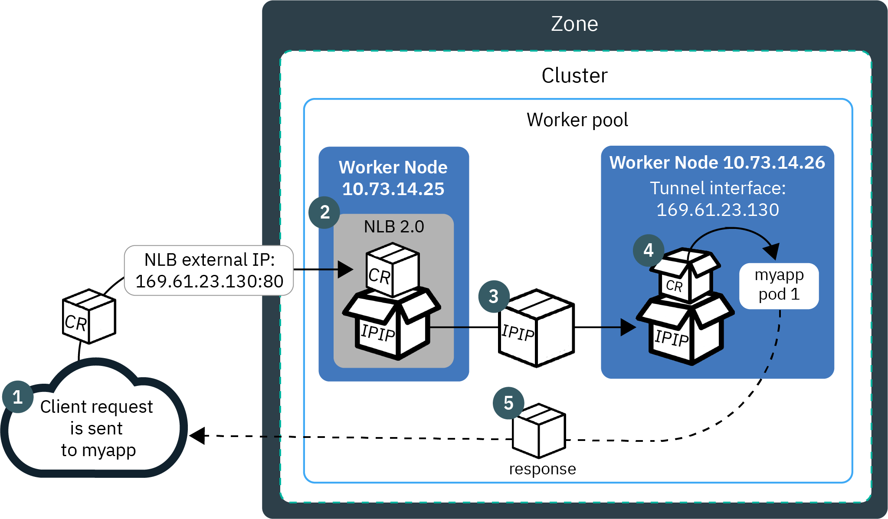

# Loadbalancer and Network Load Balancer (NLB) 1.0

## Pre-requisites

Finish the [Services](services.md), [ClusterIP](clusterip.md), and [NodePort](nodeport.md) labs.

## LoadBalancer

In the previous labs, you created a service for the `helloworld` application with a default clusterIP and then added a NodePort to the Service, which proxies requests to the Service resource. But in a production environment, you still need a load balancer, whether client requests are internal or external coming in over the public network. 

The `LoadBalancer` service in Kubernetes configures an L4 TCP Load Balancer that forwards and balances traffic from the internet to your backend application.

To use a load balancer for distributing client traffic to the nodes in a cluster, you need a public IP address that the clients can connect to, and you need IP addresses on the nodes themselves to which the load balancer can forward the requests. 

Services of type `LoadBalancer` have some limitations. It cannot do TLS termination, do virtual hosts or path-based routing, so you can’t use a single load balancer to proxy to multiple services. These limitations led to the addition in Kubernetes v1.2 of a separate kubernetes resource called `Ingress`. 

The actual creation of the load balancer happens asynchronously with the Service, so you might have to wait until the load balancer has been created.

## Load Balancer on IKS

The LoadBalancer service type is implemented differently depending on your cluster's infrastructure provider. On IKS (IBM Kubernetes Service), `classic clusters` implements a Network Load Balancer (NLB) 1.0 by default. 

Version 1.0 NLBs use network address translation (NAT) to rewrite the request packet's source IP address to the IP of worker node where a load balancer pod exists. 


Version 2.0 NLBs don't use NAT but IP over IP (IPIP) to encapsulate the original request packet into another packet, which preserves the client IP as its source IP address. The worker node then uses direct server return (DSR) to send the app response packet to the client IP.



When you create a standard cluster, IKS automatically provisions a portable public subnet and a portable private subnet. The portable public subnet provides 5 usable IP addresses. 1 portable public IP address is used by the default public `Ingress ALB`. The remaining 4 portable public IP addresses can be used to expose single apps using layer 4 (L4) TCP/UDP Network Load Balancer (NLB).

The portable public and private IP addresses are static floating IPs pointing to worker nodes. A `Keepalived` daemon  constantly monitors the IP, and automatically moves the IP to another worker node if the worker node is removed.  

See: [Classic: About network load balancers (NLBs)](https://cloud.ibm.com/docs/containers?topic=containers-loadbalancer-about#v1_planning).

## Load Balancing Methods on IKS

Before we create the `LoadBalancer` service for the `helloworld` application, review the different Load Balancing options for IKS:

- `NodePort` exposes the app via a port and public IP address on a worker node using `kube-proxy`.
- `LoadBalancer NLB v1.0 + subdomain` uses basic load balancing that exposes the app with an IP address or a subdomain.
- `LoadBalancer NLB v2.0 + subdomain`, uses Direct Server Return (DSR) load balancing, which does not change the packets but the destination address, and exposes the app with an IP address or a subdomain, supports SSL termination. Network load balancer (NLB) 2.0 is in beta. To [specify a load balancer 2.0](https://cloud.ibm.com/docs/containers?topic=containers-loadbalancer-v2#ipvs_single_zone_config) you must add annotation `service.kubernetes.io/ibm-load-balancer-cloud-provider-enable-features: "ipvs"` to the service.
- `Istio Ingress Gateway + NLB` uses basic load balancing that exposes the app with a subdomain and uses Istio routing rules.
- `Ingress with public ALB` uses HTTPS load balancing that exposes the app with a subdomain and uses custom routing rules and SSL termination for multiple apps. Customize the ALB routing rules with [annotations](https://cloud.ibm.com/docs/containers?topic=containers-ingress_annotation).
- `Custom Ingress + NLB` uses HTTPS load balancing with a custom Ingress that exposes the app with the IBM-provided ALB subdomain and uses custom routing rules.

## Create a LoadBalancer

In the previous lab, you already created a `NodePort` Service. 

```
kubectl get svc -n $MY_NS
```

Patch the service for `helloworld` and change the type to `LoadBalancer`.

```
kubectl patch svc helloworld -p '{"spec": {"type": "LoadBalancer"}}' -n $MY_NS
```

The `TYPE` should be set to `LoadBalancer` now, and an `EXTERNAL-IP` should be assigned.

```
$ kubectl get svc helloworld -n $MY_NS

NAME    TYPE    CLUSTER-IP    EXTERNAL-IP    PORT(S)    AGE
helloworld   LoadBalancer   172.21.161.255   169.48.67.163   8080:31777/TCP   24m
```

**If you use a FREE Kubernetes Service with single node**, you will see,

```
$ kubectl get svc helloworld -n $MY_NS

NAME         TYPE           CLUSTER-IP      EXTERNAL-IP   PORT(S)          AGE
helloworld   LoadBalancer   172.21.23.149   <pending>     8080:32287/TCP   15m
```

Because you do not own a subnet with public IP addresses, the `EXTERNAL-IP` will remain `<pending>`. If you describe the service, you will see an error message: `Failed to get available cloud provider IPs for load balancer services: Clusters with one node must use services of type NodePort. See https://cloud.ibm.com/docs/containers?topic=containers-cs_troubleshoot_lb for details.`.

Describe the `helloworld` LoadBalancer Service,

```
$ kubectl describe svc helloworld -n $MY_NS

Name:                     helloworld
Namespace:                my-apps
Labels:                   app=helloworld
Annotations:              <none>
Selector:                 app=helloworld
Type:                     LoadBalancer
IP:                       172.21.49.18
LoadBalancer Ingress:     169.46.16.244
Port:                     <unset>  8080/TCP
TargetPort:               http-server/TCP
NodePort:                 <unset>  30785/TCP
Endpoints:                172.30.20.145:8080,172.30.20.146:8080,172.30.20.147:8080
Session Affinity:         None
External Traffic Policy:  Cluster
Events:                   <none>
```

Now to access the Service of the `helloworld` from the public internet, you can use the public IP address of the NLB and the assigned NodePort of the service in the format `<IP_address>:<port>`. NodePorts are accessible on every public and private IP address of every worker node within the cluster.

```
PUBLIC_IP=$(kubectl get svc helloworld -n $MY_NS --output json | jq -r '.status.loadBalancer.ingress[0].ip')
echo $PUBLIC_IP

PORT=$(kubectl get svc helloworld -n $MY_NS --output json | jq -r '.spec.ports[0].nodePort' )
echo $PORT
```

Access the `helloworld` app in a browser or with Curl,

```
curl -L -X POST "http://$PUBLIC_IP:$PORT/api/messages" -H 'Content-Type: application/json' -d '{ "sender": "world2" }'

{"id":"73987562-8844-43b9-80a0-49aad2d413e9","sender":"world2","message":"Hello remko (direct)","host":null}
```

Next, go to [ExternalName](externalname.md).
