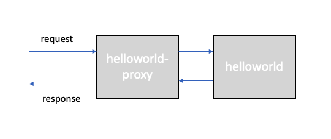

# Network Policy and Calico 

## Prerequirements

Finish the [Services](services.md), [ClusterIP](clusterip.md), [NodePort](nodeport.md), [LoadBalancer](loadbalancer.md), and [Ingress](ingress-alb.md) labs,

* Guestbook Deployment
* Guestbook Service of type LoadBalancer
* Logged in to IBM Cloud account
* Connected to Kubernetes cluster

## Network Policy and Calico

To control traffic flow at the IP address or port level (OSI layer 3 or 4), you can use Kubernetes NetworkPolicies. Network policies are implemented by a Network Plugin. 

When defining a pod- or namespace- based NetworkPolicy, labels are used to select pods and define rules which specify what traffic is allowed to the selected pods. For IP based NetworkPolicies, you define policies based on IP blocks (CIDR ranges).

By default, pods are non-isolated and accept traffic from any source. Once there is any NetworkPolicy in a namespace selecting a particular pod, that pod will be isolated and reject any connections not allowed by any NetworkPolicy. 

Network policies do not conflict; they are additive. A pod is restricted to what is allowed by the union of policies’ ingress/egress rules. Thus, order of evaluation does not affect the policy result.

There are four kinds of selectors in an ingress `from` section or egress `to` section:

- podSelector,
- namespaceSelector,
- podSelector and namespaceSelector,
- ipBlock for IP CIDR ranges.

The following example allows traffic from a frontend application to a backend application,

```
apiVersion: networking.k8s.io/v1
kind: NetworkPolicy
metadata:
  name: my-network-policy
  namespace: default
spec:
  podSelector:
    matchLabels:
      role: db
  policyTypes:
  - Ingress
  - Egress
  ingress:
  - from:
    - podSelector:
        matchLabels:
          role: frontend
    ports:
    - protocol: TCP
      port: 6379
  egress:
  - to:
    - podSelector:
        matchLabels:
          role: backend
    ports:
    - protocol: TCP
      port: 5978
```

The following example denies all ingress traffic,

```
apiVersion: networking.k8s.io/v1
kind: NetworkPolicy
metadata:
  name: default-deny-ingress
spec:
  podSelector: {}
  policyTypes:
  - Ingress
```

Every IBM Cloud Kubernetes Service cluster is set up with a network plug-in called Calico. Default network policies are set up to secure the public network interface of every worker node in the cluster. 

You can use Kubernetes and Calico to create network policies for a cluster. With Kubernetes network policies, you can specify the network traffic that you want to allow or block to and from a pod within a cluster. To set more advanced network policies such as blocking inbound (ingress) traffic to a Network Load Balancer (NLB) services, use Calico network policies.

When a Kubernetes network policy is applied, it is automatically converted into a Calico network policy so that Calico can apply it as an Iptables rule. Both incoming and outgoing network traffic can be allowed or blocked based on protocol, port, and source or destination IP addresses. Traffic can also be filtered based on pod and namespace labels.

Calico network policies are a superset of the Kubernetes network policies and are applied by using calicoctl commands. Calico policies add the following features:
- Allow or block network traffic on specific network interfaces regardless of the Kubernetes pod source or destination IP address or CIDR.
- Allow or block network traffic for pods across namespaces.
- Block inbound traffic to Kubernetes LoadBalancer or NodePort services.

Calico enforces these policies, including any Kubernetes network policies that are automatically converted to Calico policies, by setting up Linux Iptables rules on the Kubernetes worker nodes. Iptables rules serve as a firewall for the worker node to define the characteristics that the network traffic must meet to be forwarded to the targeted resource.

Calico network policies and Calico global network policies are applied using calicoctl. Syntax is similar to Kubernetes, but there a few differences

## Zero Trust Network Model

Adopting a zero trust network model is best practice for securing workloads and hosts in your cloud-native strategy.

## Create helloworld Proxy

For this tutorial, we will use an additional app called `helloworld-proxy`, which proxies requests to the `helloworld` app. 



If you don't have the repository already, clone it to your local machine,

```
git clone https://github.com/remkohdev/helloworld.git
cd helloworld
ls -al
```

Deploy the `helloworld` proxy to the same namespace as the `helloworld` app,

```
kubectl create -f helloworld-proxy-deployment.yaml -n $MY_NS
kubectl create -f helloworld-proxy-service-loadbalancer.yaml -n $MY_NS
```

The deployment in your project namespace should now look as follows,

```
kubectl get all -n $MY_NS
NAME                                    READY   STATUS    RESTARTS   AGE
pod/helloworld-77bc887769-7n8wg         1/1     Running   0          27h
pod/helloworld-77bc887769-cts4v         1/1     Running   0          27h
pod/helloworld-77bc887769-w4tmc         1/1     Running   0          27h
pod/helloworld-proxy-5f689cf785-k7n6v   1/1     Running   0          15s
pod/helloworld-proxy-5f689cf785-qmmlz   1/1     Running   0          15s
pod/helloworld-proxy-5f689cf785-wh7x7   1/1     Running   0          15s

NAME                       TYPE           CLUSTER-IP       EXTERNAL-IP    PORT(S)          AGE
service/helloworld         LoadBalancer   172.21.145.243   169.61.252.3   8080:30663/TCP   27h
service/helloworld-proxy   LoadBalancer   172.21.74.243    169.61.252.4   8080:30005/TCP   14s

NAME                               READY   UP-TO-DATE   AVAILABLE   AGE
deployment.apps/helloworld         3/3     3            3           27h
deployment.apps/helloworld-proxy   3/3     3            3           15s

NAME                                          DESIRED   CURRENT   READY   AGE
replicaset.apps/helloworld-77bc887769         3         3         3       27h
replicaset.apps/helloworld-proxy-5f689cf785   3         3         3       15s
```

Get the proxy service details and test the proxy,

```
PROXY_HOST=$(kubectl get svc helloworld-proxy -n $MY_NS --output json | jq -r '.status.loadBalancer.ingress[0].ip')
echo $PROXY_HOST

PROXY_NODEPORT=$(kubectl get svc helloworld-proxy -n $MY_NS --output json | jq -r '.spec.ports[0].nodePort')
echo $PROXY_NODEPORT
```

Test the `helloworld-proxy` app, add the `host: helloworld:8080` property in the data object, which tells the `helloworld-proxy` app to proxy the message to the `host` app, and send the request to the `/api/messages` endpoint of our `helloworld` app on port `8080` using the internal DNS for service discovery. Because it is an internal request, the proxy uses the container port rather than the NodePort, which is used for external requests.

```
curl -L -X POST "http://$PROXY_HOST:$PROXY_NODEPORT/proxy/api/messages" -H 'Content-Type: application/json' -H 'Content-Type: application/json' -d '{ "sender": "remko", "host": "helloworld:8080" }'

{"id":"6e5ef78f-9e09-42f8-8294-347ece7cd07f","sender":"remko","message":"Hello remko (proxy)","host":"helloworld:8080"}
```

The source code for the helloworld application can be found [here](https://github.com/remkohdev/helloworld/blob/master/src/main/java/com/example/helloworld/APIController.java).

## Apply Network Policy - Deny All Traffic

Define the Network Policy file to deny all traffic,

```
echo 'apiVersion: networking.k8s.io/v1
kind: NetworkPolicy
metadata:
  name: helloworld-deny-all
spec:
  podSelector: {}
  policyTypes:
  - Ingress
  - Egress' > helloworld-policy-denyall.yaml
```

Create the Network Policy,

```
kubectl create -f helloworld-policy-denyall.yaml -n $MY_NS

networkpolicy.networking.k8s.io/helloworld-deny-all created
```

If you need the `PUBLIC_IP` of the `helloworld` app again,

```
PUBLIC_IP=$(ibmcloud ks workers --cluster $KS_CLUSTER_NAME --json | jq '.[0]' | jq -r '.publicIP')
echo $PUBLIC_IP

PORT=$(kubectl get svc helloworld -n $MY_NS --output json | jq -r '.spec.ports[0].nodePort' )
echo $PORT
```

Test both the `helloworld` and the `helloworld-proxy` apps,

```
curl -L -X POST "http://$PUBLIC_IP:$PORT/api/messages" -H 'Content-Type: application/json' -d '{ "sender": "remko" }'

curl: (7) Failed to connect to 52.118.3.110 port 30663: Operation timed out

curl -L -X POST "http://$PROXY_HOST:$PROXY_PORT/proxy/api/messages" -H 'Content-Type: application/json' -H 'Content-Type: application/json' -d '{ "sender": "remko", "host": "helloworld:8080" }'

curl: (7) Failed to connect to 169.61.252.4 port 80: Operation timed out
```

It takes quite a long time before connections time out. All traffic is denied, despite that we have a LoadBalancer service added to each deployment,

```
kubectl get svc -n $MY_NS

NAME               TYPE           CLUSTER-IP       EXTERNAL-IP    PORT(S)          AGE
helloworld         LoadBalancer   172.21.145.243   169.61.252.3   8080:30663/TCP   30h
helloworld-proxy   LoadBalancer   172.21.74.243    169.61.252.4   8080:30005/TCP   141m
```

## Apply Network Policy - Allow Only Traffic to Pod

Let's allow direct ingress traffic to the `helloworld` app on port `8080`, but not allow traffic to the `helloworld-proxy` app. 

Define the Network Policy file,

```
echo 'apiVersion: networking.k8s.io/v1
kind: NetworkPolicy
metadata:
  name: allow-helloworld
spec:
  policyTypes:
    - Ingress
  podSelector:
    matchLabels:
      app: helloworld
  ingress:
    - {}' > helloworld-allow.yaml
```

Create the Network Policy,

```
kubectl create -f helloworld-allow.yaml -n $MY_NS

networkpolicy.networking.k8s.io/allow-helloworld created
```

Review the existing NetworkPolices in the project namespace,

```
$ kubectl get networkpolicies -n $MY_NS
NAME                  POD-SELECTOR     AGE
allow-helloworld      app=helloworld   53m
helloworld-deny-all   <none>           125m
```

Test the `helloworld` and the `helloworld-proxy' apps again,

```
curl -L -X POST "http://$PUBLIC_IP:$PORT/api/messages" -H 'Content-Type: application/json' -d '{ "sender": "remko4" }'

{"id":"fa172490-b685-40f9-8f6a-0de35119839a","sender":"remko4","message":"Hello remko4 (direct)","host":null}

curl -L -X POST "http://$PROXY_HOST:$PROXY_PORT/proxy/api/messages" -H 'Content-Type: application/json' -H 'Content-Type: application/json' -d '{ "sender": "remko4", "host": "helloworld:8080" }'

curl: (7) Failed to connect to 169.61.252.4 port 80: Operation timed out
```

## Cleanup

Delete the NetworkPolicies in your namespace,

```
kubectl delete  networkpolicy allow-helloworld -n $MY_NS
kubectl delete networkpolicy helloworld-deny-all -n $MY_NS
```

Delete the previously created resources,

```
kubectl get all -n $MY_NS

kubectl delete deployment helloworld -n $MY_NS
kubectl delete deployment helloworld-proxy -n $MY_NS
kubectl delete svc helloworld -n $MY_NS
kubectl delete svc helloworld-proxy -n $MY_NS
kubectl delete namespace $MY_NS
```
