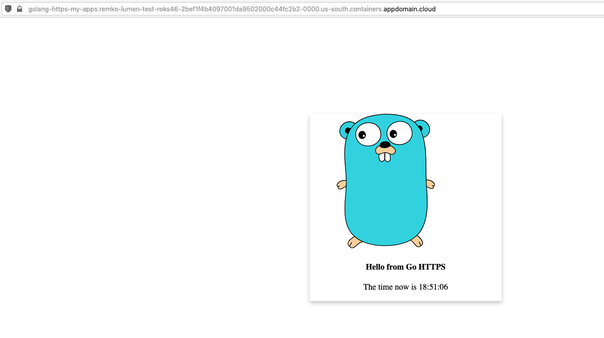
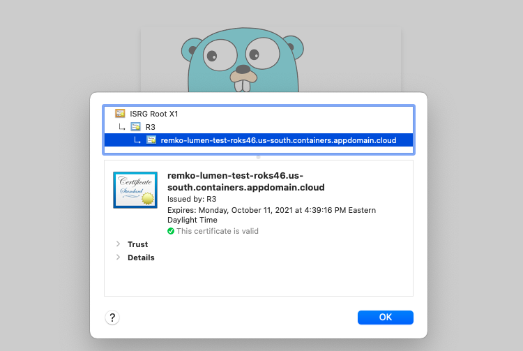

# Secured Routes

## Introduction

In OpenShift, there are different types of routes in which you can expose your applications:

* clear,
* edge,
* reencrypt, and
* pass-through.

The clear route is insecure and doesn't require any certifications, as for the rest of the routes, they are encrypted on different levels and require certificates.

In this tutorial, you will learn how to create 3 types of routes for your applications: clear, edge and passthrough and you will learn the difference in creating each type of route.

## Estimated Time

It will take you around 20 minutes to complete this tutorial.

Steps:

* [Extract the SSL Cert Secret](https://github.com/nerdingitout/oc-route#extract-the-ssl-cert-secret)
* [Create Edge Route](https://github.com/nerdingitout/oc-route#create-edge-route)
* [Create Golang Application](https://github.com/nerdingitout/oc-route/blob/main/README.md#create-golang-application)
* [Create Passthrough Route](https://github.com/nerdingitout/oc-route#create-passthrough-route)

## Expose the Service

* To view the service that we need to expose. Use the following command.

```bash
$ oc get svc
NAME         TYPE           CLUSTER-IP       EXTERNAL-IP      PORT(S)          AGE
helloworld   LoadBalancer   172.21.211.147   169.48.231.227   8080:31239/TCP   3h21m
```

## Extract the SSL Cert Secret

Let's take a look at the secrets in openshift-ingress project. You will need a TLS secret that's generated for your cluster which is of type kubernetes.io/tls.

```bash
$ oc get secrets -n openshift-ingress | grep kubernetes.io/tls
mycluster-roks46-2bef1f4b4097001da9502000c44fc2b2-0000   kubernetes.io/tls                     2      21h
router-metrics-certs-default                             kubernetes.io/tls                     2      21h
```

View the secret values in your command line, notice that the key and certificate pair are saved in PEM encoded files.

```bash
TLS_SECRET_NAME=<secret name from previous step>
oc extract secret/$TLS_SECRET_NAME -n openshift-ingress --to *
```


Create a directory `tmp` and save the secret in a temporary directory,

```bash
$ mkdir tmp
$ oc extract secret/$TLS_SECRET_NAME -n openshift-ingress --to=/tmp 
/tmp/tls.crt
/tmp/tls.key
```

## Create Edge Route

* Create the edge route using the following command

```bash
oc create route edge --service helloworld --key ./tmp/tls.key --cert ./tmp/tls.crt
```

Get the route using the following command,

```bash
$ oc get route helloworld
NAME         HOST/PORT                                                                                                              PATH   SERVICES     PORT    TERMINATION   WILDCARD
helloworld   helloworld-my-apps.remko-lumen-test-roks46-2bef1f4b4097001da9502000c44fc2b2-0000.us-south.containers.appdomain.cloud          helloworld   <all>   edge          None
```

Retrieve the created host for the Route and the NodePort of the `helloworld` service,

```bash
ROUTE=$(oc get routes -n $MY_NS -o json | jq -r '.items[0].spec.host')
echo $ROUTE

NODE_PORT=$(oc get svc helloworld -n $MY_NS --output json | jq -r '.spec.ports[0].nodePort' )
echo $NODE_PORT
```

Send a request to the Route host for your Service,

```bash
$ curl -L -X POST "http://$ROUTE:$NODE_PORT/api/messages" -H 'Content-Type: application/json' -d '{ "sender": "world6" }'
{"id":"0c064241-5cb9-4267-883e-ed98bcdb4a3a","sender":"world6","message":"Hello world6 (direct)","host":null}
```

## Create Golang Application

In this section, you will be deploying a new application that you will be using for both passthrough and re-encrypt routes, then you will create a secret and mount it to the volume so you can create the routes.

Create the deployment config and service using oc create command.

```bash
$ oc create -f https://raw.githubusercontent.com/nerdingitout/oc-route/main/golang-https.yml
deploymentconfig.apps.openshift.io/golang-https created
service/golang-https created
```

Create TLS secret using the same secret you extracted earlier.

```bash
$ oc create secret tls mycert --cert ./tmp/tls.crt --key ./tmp/tls.key
secret/mycert created
```

Mount the secret to your volume.

```bash
$ oc set volume dc/golang-https --add -t secret -m /go/src/app/certs --name cert --secret-name mycert
deploymentconfig.apps.openshift.io/golang-https volume updated
```

## Create Passthrough Route

Create the passthrough route,

```bash
$ oc create route passthrough golang-https --service golang-https
route.route.openshift.io/golang-https created
```

Get the URL,

```bash
$ oc get route golang-https
NAME           HOST/PORT                                                                                                                PATH   SERVICES       PORT    TERMINATION   WILDCARD
golang-https   golang-https-my-apps.remko-lumen-test-roks46-2bef1f4b4097001da9502000c44fc2b2-0000.us-south.containers.appdomain.cloud          golang-https   <all>   passthrough   None
```

Access the application,



View the certificate,



## Resources

You can learn more using the following resources:

* [OpenShift Routes on IBM Cloud](https://cloud.ibm.com/docs/openshift?topic=openshift-openshift_routes)
* [OpenSSL](https://www.digicert.com/kb/ssl-support/openssl-quick-reference-guide.htm)
* [Self-Serviced End-to-end Encryption Approaches for Applications Deployed in OpenShift](https://www.openshift.com/blog/self-serviced-end-to-end-encryption-approaches-for-applications-deployed-in-openshift)
* [Secured Routes](https://docs.openshift.com/container-platform/4.5/networking/routes/secured-routes.html)
* [End to End Encryption with OpenShift: Part 1](https://developers.redhat.com/blog/2017/01/24/end-to-end-encryption-with-openshift-part-1-two-way-ssl/)
* [End to End Encryption with OpenShift: Part 2](https://www.openshift.com/blog/self-serviced-end-to-end-encryption-for-kubernetes-applications-part-2-a-practical-example)

## Next

Next, go to [Network Policy](../calico/networkpolicy.md).
