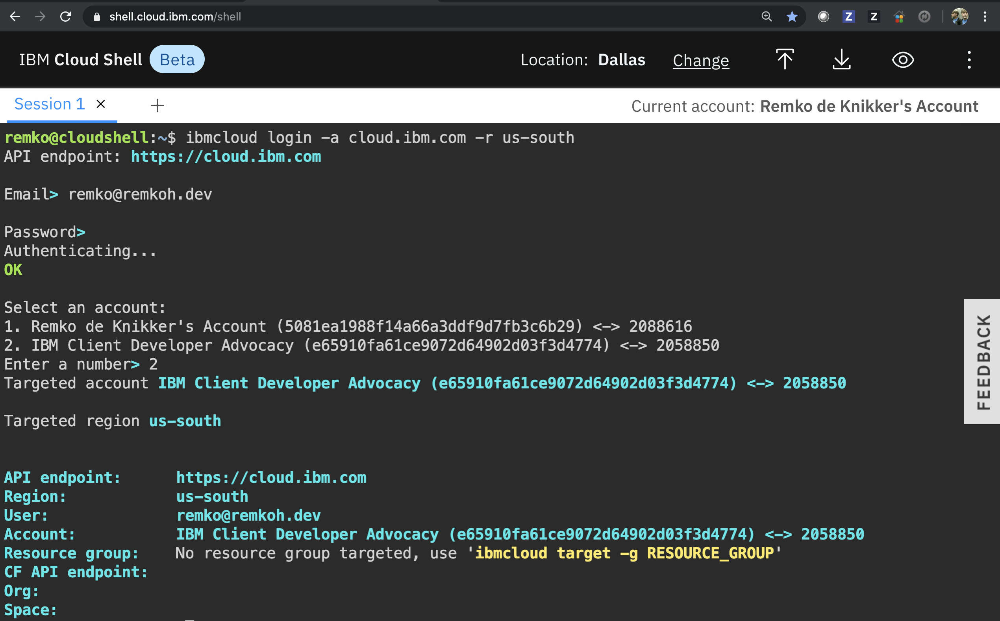

# Setup

## Pre-requisities

* Free IBM Cloud account, to create a new IBM Cloud account go [here](https://ibm.github.io/workshop-setup/NEWACCOUNT/).
* Free `Pay-As-You-Go` account. To upgrade a free IBM Cloud account, go [here](https://ibm.github.io/workshop-setup/PAYASYOUGO/).
* Client terminal with:
    * IBM Cloud CLI,
    * IBM CLoud CLI Kubernetes Service plugin,
    * IBM CLoud CLI Infrastructure Service plugin,
* kubectl CLI,
    * OpenShift commandline `oc` CLI,
* Recommended client terminals:
    * CognitiveLabs.ai, to access a client terminal at CognitiveLabs.ai, go [here](https://ibm.github.io/workshop-setup/COGNITIVECLASS/),
    * IBM OpenLabs
    * IBM Cloud Shell
* Kubernetes cluster:
    * IBM Cloud Kubernetes Service (IKS) v1.18 with a standard plan, a classic provider,
    * **OR** an Red Hat OpenShift Kubernetes Service v4.5 with a classic provider,
    * at least 2 worker nodes (with a subnet and public IPs, external LoadBalancer (for details about VLAN, subnets and IPs, see [here](https://cloud.ibm.com/docs/containers?topic=containers-subnets) ),

## Setup Kubernetes Cluster

* To use an IBM provided Kubernetes cluster with your IBM Cloud account and IBMId, grant access permissions to the cluster, as instructed [here](https://ibm.github.io/workshop-setup/GRANTCLUSTER/).
* To connect to a managed `Red Hat OpenShift Kubernetes Service (ROKS)`, go [here](https://ibm.github.io/workshop-setup/ROKS/).
* To access a client terminal and OpenShift cluster at OpenLabs follow the instructions [here](https://ibm.github.io/workshop-setup/OPENLABS/).

## Setup Client Terminal

This workshop was tested using:

* An [IBM Cloud Shell](https://cloud.ibm.com/shell) instance, image version 1.0.25

## Login to IBM Cloud

1. Using IBM Cloud Shell, you will already be logged in,
1. Using an external shell, log in to IBM Cloud,

    ```console
    IBMID=<your IBMID email>
    ibmcloud login -u $IBMID
    ```

1. If you are using federated SSO login, use the `-sso` flag instead.
1. Select the account in which the cluster was created.

    

## Connect to IKS Cluster

1. Set the `KS_CLUSTER_NAME` environment variable to the correct cluster name,

    ```console
    KS_CLUSTER_NAME=<your cluster name>
    ```

1. Optionally, if you don't know your cluster name, list all clusters,

    ```console
    ibmcloud ks clusters
    ```

1. Or search for all clusters that contain a known substring,

    ```console
    KS_NAME_SUB=<substring>
    ibmcloud ks clusters --output json | jq -r 'map(select(.name | contains('\"$KS_NAME_SUB\"')))'
    ```

1. Create an environment variable `$MY_NS` for the desired target namespace,

    ```console
    MY_NS=my-apps
    ```

1. For IKS, download the cluster configuration to the client,

    ```console
    ibmcloud ks cluster config --cluster $KS_CLUSTER_NAME
    oc config current-context
    ```

1. The config should be set to a `clustername/clusterid` pair,

## Connect to OpenShift Cluster

1. For OpenShift, find the `oc login` command with the login token. To connect to a managed `Red Hat OpenShift Kubernetes Service (ROKS)`, follow the instructions [here](https://ibm.github.io/workshop-setup/ROKS/). For example,

    ```console
    $ oc login --token=e6PfXsQKjxiUf7qkb4jJxEd851pa0ZuUSEimVuGt4aQ --server=https://c114-e.us-south.containers.cloud.ibm.com:32115

    Logged into "https://c109-e.us-east.containers.cloud.ibm.com:31345" as "IAM#b.newell2@remkoh.dev" using the token provided.

    You have access to x projects, the list has been suppressed. You can list all projects with 'oc projects'

    Using project "default".
    ```

## Get Helloworld Source Code

In this workshop, we will use a `helloworld` application. The source code, Maven build file, container images, and Kubernetes resource specifications are included in the repository. To get started, clone the `helloworld` repository to your client,

```console
git clone https://github.com/remkohdev/helloworld.git
cd helloworld
ls -al
```

## Next

Next, go to [Services](../services/services.md).
