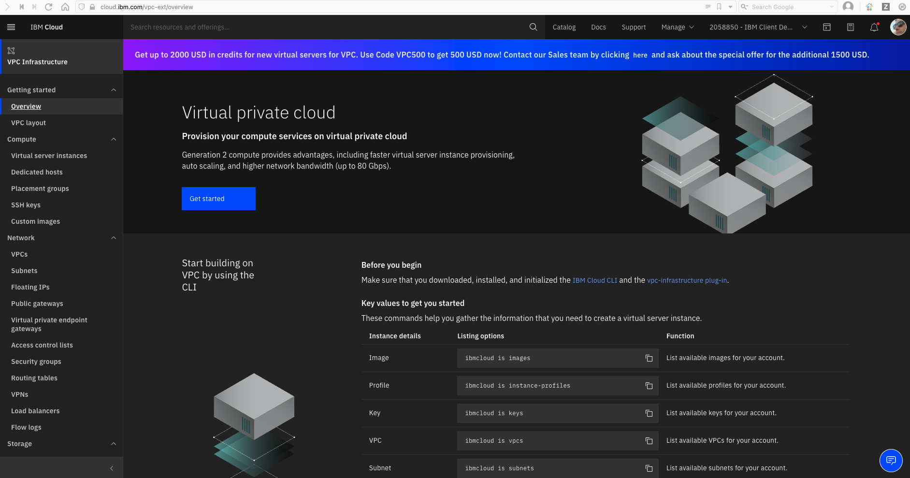
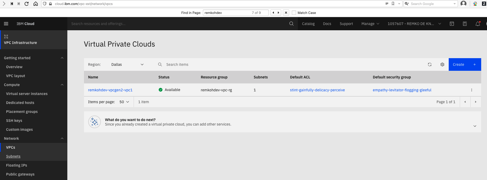
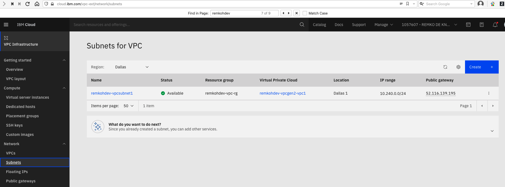
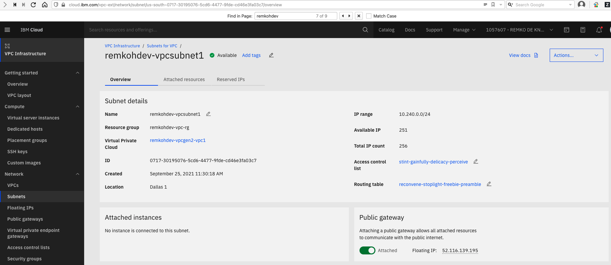
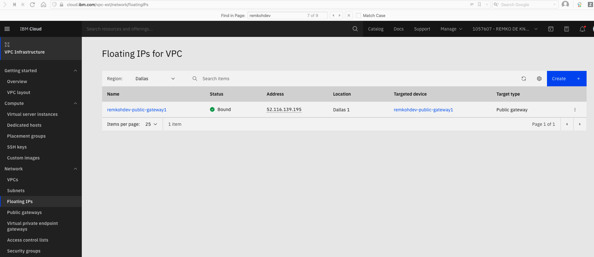
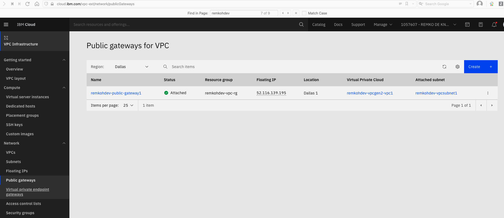
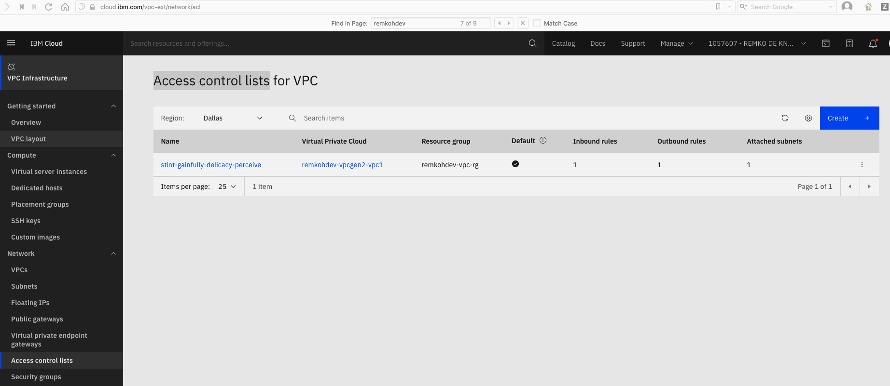
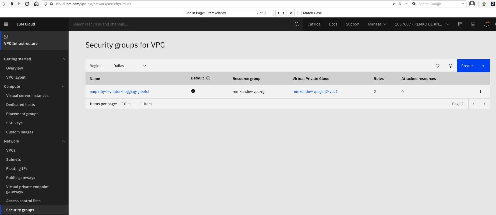
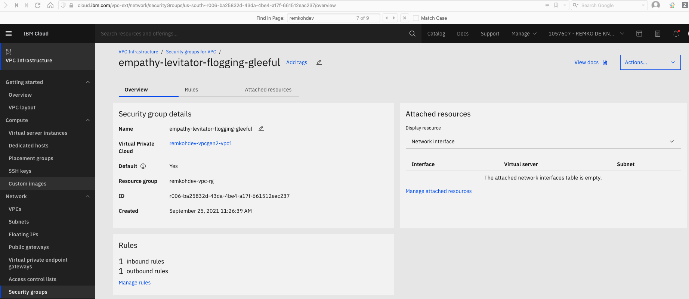
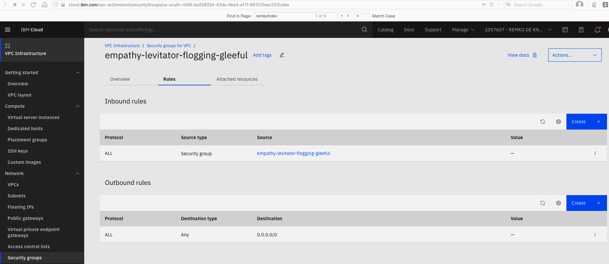

# Review VPC Infrastructure

To check your VPC resources in IBM Cloud, browse to the `VPC Infrastructure` dashboard at [https://cloud.ibm.com/vpc-ext/overview](https://cloud.ibm.com/vpc-ext/overview).

From the left menu, list the VPCs,

List the [Subnets for VPC](https://cloud.ibm.com/vpc-ext/network/subnets),

Click the linked subnet name to view the new subnet details,

You should see a public gateway attached with a floating IP.

Go to [Floating IPs](https://cloud.ibm.com/vpc-ext/network/floatingIPs),

Go to Public gateways,

Go to Access control lists,

Notice, there is 1 `Inbound rule` and 1 `Outbound rule` defined.

Go to Security groups,

Click on the linked security group to review the secuirty group's details,

Click the `Rules` tab,

## Conclusion

You are awesome! You created a Virtual Private Cloud (VPC) with a subnet, a security group with access rules to control inbound and outbound traffic, and attached a public gateway with a floating IP as an access point.

## Next

Next, [create a Red Hat OpenShift Kubernetes Service (ROKS)](../vpc_roks/1_create_roks_for_vpc.md) or create an IBM Cloud Kubernetes Service instance.
