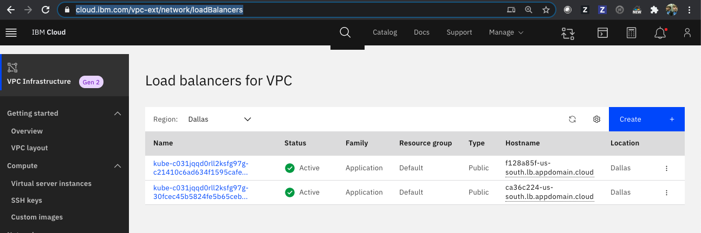
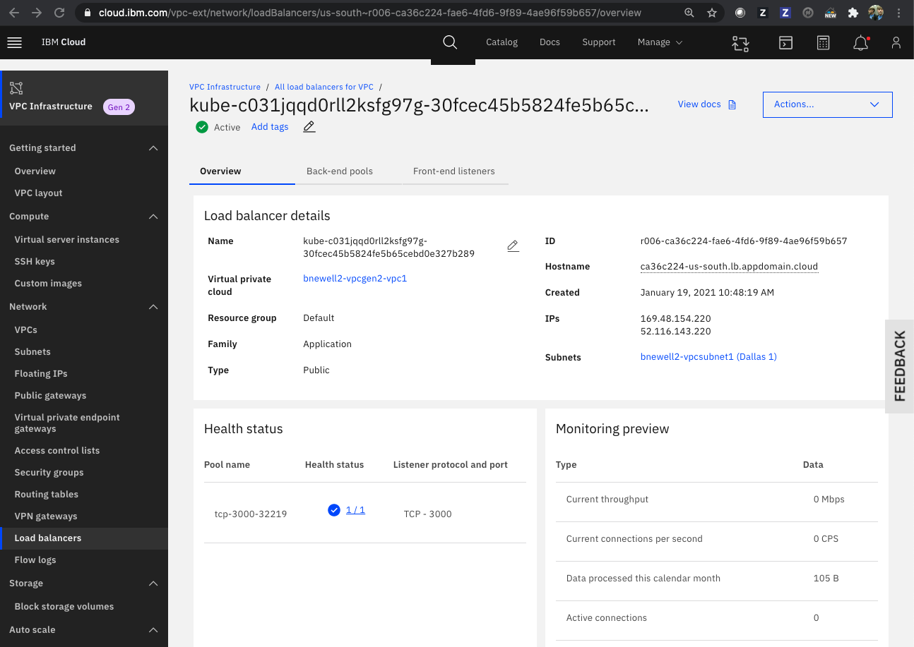
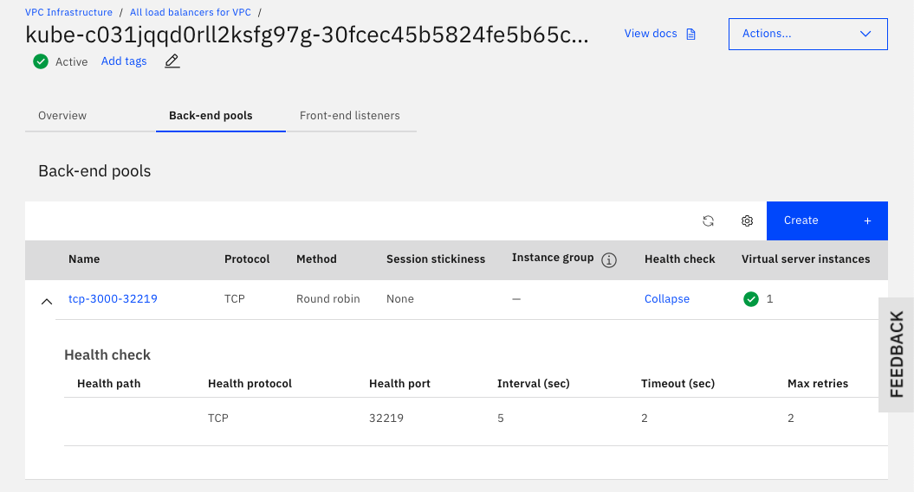
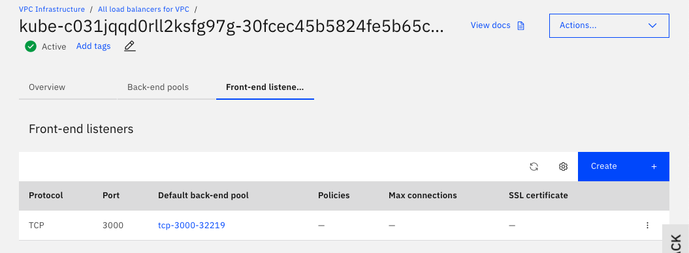

# Understanding the Load Balancer for VPC

To access the guestbook application via the Load Balancer for VPC, we are using the `port` of the Service object instead of the `NodePort`, which is the port we allowed inbound traffic on and which is the port value we used to access our deployment without a VPC. To see why, let's take a step back and go to the list of [Load balancers for VPC](https://cloud.ibm.com/vpc-ext/network/loadBalancers).



Click the load balancer with the hostname that corresponds to the `External IP` of the `LoadBalacer` service we created earlier.



You see a few tabs under the long name for `Back-end pools` and `Front-end listeners`. You see the `Hostname` that corresponds to the external IP of the `LoadBalancer` service for the guestbook application. And you see a `Health status` panel with a `Pool name` value of `tcp-3000-32219` with a `Listener protocol and port` of value `TCP - 3000`.

Click on the `Back-end pool` tab and expand the `tcp-3000-32219` pool.



Note the `Health port` for the back-end pool is the `NodePort` of the guestbook service, and the distribution method used is `round robin`. You also see that a virtual server is attached on IP address `10.240.0.4`, the private IP address of the worker node of our cluster, and on port `$SVC_NODEPORT`, the `NodePort` value of the guestbook service.

Click on the `Front-end listener` tab and note that `Port` is set to the `port` of the guestbook service. The front-end listener is mapped to the back-end pool `tcp-3000-32219` or `tcp-$SVC_PORT-$SVC_NODEPORT`.



That tells us that it is the load balancer for VPC that maps external traffic to our guestbook application via the `hostname:port` of the front end listener to the back-end pool with the private IP of the cluster in the IP range of our VPC `10.240.0.0/24`, and the NodePort of the guestbook service.

You can also use the CLI to analyze how the traffic flows. Let's inspect the guestbook Service of type LoadBalancer resource in more detail.

```bash
kubectl get svc -n $MY_NAMESPACE --output json 

{
    "apiVersion": "v1",
    "items": [
        {
            "apiVersion": "v1",
            "kind": "Service",
            "metadata": {
                "creationTimestamp": "2020-12-23T03:08:27Z",
                "finalizers": [
                    "service.kubernetes.io/load-balancer-cleanup"
                ],
                "labels": {
                    "app": "guestbook"
                },
                "managedFields": [
                    {
                        "apiVersion": "v1",
                        "fieldsType": "FieldsV1",
                        "fieldsV1": {
                            "f:metadata": {
                                "f:labels": {
                                    ".": {},
                                    "f:app": {}
                                }
                            },
                            "f:spec": {
                                "f:externalTrafficPolicy": {},
                                "f:ports": {
                                    ".": {},
                                    "k:{\"port\":3000,\"protocol\":\"TCP\"}": {
                                        ".": {},
                                        "f:port": {},
                                        "f:protocol": {},
                                        "f:targetPort": {}
                                    }
                                },
                                "f:selector": {
                                    ".": {},
                                    "f:app": {}
                                },
                                "f:sessionAffinity": {},
                                "f:type": {}
                            }
                        },
                        "manager": "kubectl-expose",
                        "operation": "Update",
                        "time": "2020-12-23T03:08:26Z"
                    },
                    {
                        "apiVersion": "v1",
                        "fieldsType": "FieldsV1",
                        "fieldsV1": {
                            "f:metadata": {
                                "f:finalizers": {
                                    ".": {},
                                    "v:\"service.kubernetes.io/load-balancer-cleanup\"": {}
                                }
                            },
                            "f:status": {
                                "f:loadBalancer": {
                                    "f:ingress": {}
                                }
                            }
                        },
                        "manager": "ibm-cloud-controller-manager",
                        "operation": "Update",
                        "time": "2020-12-23T03:29:13Z"
                    }
                ],
                "name": "guestbook",
                "namespace": "my-guestbook",
                "resourceVersion": "6502",
                "selfLink": "/api/v1/namespaces/my-guestbook/services/guestbook",
                "uid": "22bf711e-08e0-4827-8299-53a008b52481"
            },
            "spec": {
                "clusterIP": "172.21.48.26",
                "externalTrafficPolicy": "Cluster",
                "ports": [
                    {
                        "nodePort": 32219,
                        "port": 3000,
                        "protocol": "TCP",
                        "targetPort": 3000
                    }
                ],
                "selector": {
                    "app": "guestbook"
                },
                "sessionAffinity": "None",
                "type": "LoadBalancer"
            },
            "status": {
                "loadBalancer": {
                    "ingress": [
                        {
                            "hostname": "7a6a66a7-us-south.lb.appdomain.cloud"
                        }
                    ]
                }
            }
        }
    ],
    "kind": "List",
    "metadata": {
        "resourceVersion": "",
        "selfLink": ""
    }
}
```

**Note:**

Service resource lists a property `status.loadBalancer.ingress` with `hostname`. We use the `hostname` to access the Guestbook Service.

The `spec.ports.nodePort` is the port on the worker nodes through which external traffic comes to the cluster. The `spec.ports.port` is the incoming port that the service listens for requests that are forwarded by Kubernetes from the NodePort. Requests are finally sent to the `spec.ports.targetPort` on any pod. Traffic flow:

nodePort -> port -> targetPort

The `externalTrafficPolicy` property is set to Cluster, which always routes traffic to all pods running a service with equal distribution, with a Service type of LoadBalancer for distributing traffic.

Our deployment however is using an Ingress load balancer with an Application Load Balancer (ALB), that includes an external load balancer, which in the architecture of a VPC network is a VPC load balancer with a VPC hostname. When you create an inbound rule for the VPC load balancer, IBM Cloud defines the front-end listener mapped to the back-end pool, and uses the port and the nodeport respectively to load balance traffic.

## Ingress Application Load Balancer (ALB)

Ingress is a Kubernetes service that balances network traffic workloads in your cluster by forwarding public or private requests to your apps by using a unique public or private route. The Ingress application load balancer (ALB) is a layer 7 (L7) load balancer, which implements the NGINX Ingress controller. A layer 4 (L4) LoadBalancer service exposes the ALB so that the ALB can receive external requests that come into your cluster.

An `Ingress` deployment consists of three components:

* Ingress resources,
* an internal L7 Application Load Balancer (ALB),
* an external L4 load balancer to handle incoming requests across zones. For classic clusters, this component is the Multi-Zone Load Balancer (MZLB) that IBM Cloud Kubernetes Service creates for you. For VPC clusters, this component is the VPC load balancer created in your VPC.

To expose an app by using Ingress, you must create a Kubernetes service for your app and register this service with Ingress by defining an Ingress resource. (To learn how, go to [Ingress and ALB](ingress-alb.md)).

The following diagram shows how Ingress directs communication from the internet to an app in a VPC multizone cluster.


[source](https://cloud.ibm.com/docs/containers?topic=containers-ingress-about#architecture-vpc)

A VPC load balancer listens for external traffic, and based on the resolved IP address, the VPC load balancer sends the request to an available Application Load Balancer (ALB). The Application Load Balancer (ALB) listens for incoming HTTP, HTTPS, or TCP service requests, checks if routing rules exist for the application, and then forwards requests to the appropriate app pod according to the rules defined in the Ingress resource.

In the IKS instance, there is a private and a public Ingress ALB installed, the private Ingress ALB is disabled.

```bash
ibmcloud ks ingress alb ls -c $MY_CLUSTER_NAME

OK
ALB ID    Enabled    State    Type    Load Balancer Hostname    Zone    Build    Status   
private-crbvhau5gd0do97g1vvo50-alb1    false    disabled    private    -    us-south-1    ingress:/ingress-auth:     -    
public-crbvhau5gd0do97g1vvo50-alb1    true    enabled    public    1e7d00e2-us-south.lb.appdomain.cloud    us-south-1    ingress:0.35.0_826_iks/ingress-auth:    -
```

List the VPC Load Balancers that were created,

```bash
ibmcloud is load-balancers

Listing load balancers for generation 2 compute in all resource groups and region us-south under account Remko de Knikker as user b.newell2@remkoh.dev...

ID    Name    Family    Subnets    Is public    Provision status    Operating status    Resource group
r006-1e7d00e2-cc50-4f5b-a12f-b5bcfa95c439    kube-bvhau5gd0do97g1vvo50-c974a95bc72740fba2839a191ba23e17    Application    remkohdev-vpcsubnet1    true    active    online    Default    
r006-7a6a66a7-9871-473e-b105-20640caa0f77    kube-bvhau5gd0do97g1vvo50-22bf711e08e04827829953a008b52481    Application    remkohdev-vpcsubnet1    true    active    online    Default
```

The `Family` property is listed as value `Application` (Application Load Balancer (ALB)) and the `Name` is listed as value `dynamic`. This means that IBM Cloud Application Load Balancer for VPC integrates with instance groups, which can auto scale your back-end members. Pool members are dynamically added and deleted based on your usage and requirements. Round-robin is the default load-balancing method, but you can also use weighted round-robin or least connections.

Inspect details for each VPC ALB and inspect Listeners, Pools and Pool Members,

```bash
MY_LOAD_BALANCER_ID=r006-7a6a66a7-9871-473e-b105-20640caa0f77
ibmcloud is load-balancer $MY_LOAD_BALANCER_ID --output json

{
    "created_at": "2020-12-23T03:29:11.831Z",
    "crn": "crn:v1:bluemix:public:is:us-south:a/31296e3a285f42fdadd51ce14beba65e::load-balancer:r006-7a6a66a7-9871-473e-b105-20640caa0f77",
    "hostname": "7a6a66a7-us-south.lb.appdomain.cloud",
    "href": "https://us-south.iaas.cloud.ibm.com/v1/load_balancers/r006-7a6a66a7-9871-473e-b105-20640caa0f77",
    "id": "r006-7a6a66a7-9871-473e-b105-20640caa0f77",
    "is_public": true,
    "listeners": [
        {
            "deleted": {
                "more_info": null
            },
            "href": "https://us-south.iaas.cloud.ibm.com/v1/load_balancers/r006-7a6a66a7-9871-473e-b105-20640caa0f77/listeners/r006-a7ca3e8f-e8d5-4ac4-8dcb-ce076dc2d01c",
            "id": "r006-a7ca3e8f-e8d5-4ac4-8dcb-ce076dc2d01c"
        }
    ],
    "logging": {
        "datapath": {
            "active": false
        }
    },
    "name": "kube-bvhau5gd0do97g1vvo50-22bf711e08e04827829953a008b52481",
    "operating_status": "online",
    "pools": [
        {
            "deleted": {
                "more_info": null
            },
            "href": "https://us-south.iaas.cloud.ibm.com/v1/load_balancers/r006-7a6a66a7-9871-473e-b105-20640caa0f77/pools/r006-338f0670-7a16-45e0-b42c-ca5f9a3bd492",
            "id": "r006-338f0670-7a16-45e0-b42c-ca5f9a3bd492",
            "name": "tcp-3000-32219"
        }
    ],
    "private_ips": [
        {
            "address": "10.240.0.7"
        },
        {
            "address": "10.240.0.8"
        }
    ],
    "profile": {
        "family": "Application",
        "href": "https://us-south.iaas.cloud.ibm.com/v1/load_balancer/profiles/dynamic",
        "name": "dynamic"
    },
    "provisioning_status": "active",
    "public_ips": [
        {
            "address": "52.116.134.164"
        },
        {
            "address": "52.116.142.235"
        }
    ],
    "resource_group": {
        "href": "https://resource-controller.cloud.ibm.com/v1/resource_groups/68af6383f717459686457a6434c4d19f",
        "id": "68af6383f717459686457a6434c4d19f",
        "name": "Default"
    },
    "security_groups": null,
    "subnets": [
        {
            "deleted": {
                "more_info": null
            },
            "href": "https://us-south.iaas.cloud.ibm.com/v1/subnets/0717-78f8f62d-7865-4547-8afd-6e6e3eb37f11",
            "id": "0717-78f8f62d-7865-4547-8afd-6e6e3eb37f11",
            "name": "remkohdev-vpcsubnet1"
        }
    ]
}

MYLOAD_BALANCER_LISTENER_ID=r006-a7ca3e8f-e8d5-4ac4-8dcb-ce076dc2d01c
ibmcloud is load-balancer-listener $MY_LOAD_BALANCER_ID $MYLOAD_BALANCER_LISTENER_ID --output json

{
    "created_at": "2020-12-23T03:29:12.078Z",
    "default_pool": {
        "deleted": {
            "more_info": null
        },
        "href": "https://us-south.iaas.cloud.ibm.com/v1/load_balancers/r006-7a6a66a7-9871-473e-b105-20640caa0f77/pools/r006-338f0670-7a16-45e0-b42c-ca5f9a3bd492",
        "id": "r006-338f0670-7a16-45e0-b42c-ca5f9a3bd492",
        "name": "tcp-3000-32219"
    },
    "href": "https://us-south.iaas.cloud.ibm.com/v1/load_balancers/r006-7a6a66a7-9871-473e-b105-20640caa0f77/listeners/r006-a7ca3e8f-e8d5-4ac4-8dcb-ce076dc2d01c",
    "id": "r006-a7ca3e8f-e8d5-4ac4-8dcb-ce076dc2d01c",
    "policies": null,
    "port": 3000,
    "protocol": "tcp",
    "provisioning_status": "active"
}

ibmcloud is load-balancer-pools $MY_LOAD_BALANCER_ID --output json

[
    {
        "algorithm": "round_robin",
        "created_at": "2020-12-23T03:29:11.957Z",
        "health_monitor": {
            "delay": 5,
            "max_retries": 2,
            "port": 32219,
            "timeout": 2,
            "type": "tcp"
        },
        "href": "https://us-south.iaas.cloud.ibm.com/v1/load_balancers/r006-7a6a66a7-9871-473e-b105-20640caa0f77/pools/r006-338f0670-7a16-45e0-b42c-ca5f9a3bd492",
        "id": "r006-338f0670-7a16-45e0-b42c-ca5f9a3bd492",
        "members": [
            {
                "deleted": {
                    "more_info": null
                },
                "href": "https://us-south.iaas.cloud.ibm.com/v1/load_balancers/r006-7a6a66a7-9871-473e-b105-20640caa0f77/pools/r006-338f0670-7a16-45e0-b42c-ca5f9a3bd492/members/r006-c422b1cb-79ee-44fc-8360-d4ebcaf1dd51",
                "id": "r006-c422b1cb-79ee-44fc-8360-d4ebcaf1dd51",
                "port": null,
                "target": null
            }
        ],
        "name": "tcp-3000-32219",
        "protocol": "tcp",
        "provisioning_status": "active",
        "proxy_protocol": "disabled"
    }
]

MY_LOAD_BALANCER_POOL_ID=r006-338f0670-7a16-45e0-b42c-ca5f9a3bd492
ibmcloud is load-balancer-pool-members $MY_LOAD_BALANCER_ID $MY_LOAD_BALANCER_POOL_ID --output json

[
    {
        "created_at": "2020-12-23T03:29:11.981Z",
        "health": "ok",
        "href": "https://us-south.iaas.cloud.ibm.com/v1/load_balancers/r006-7a6a66a7-9871-473e-b105-20640caa0f77/pools/r006-338f0670-7a16-45e0-b42c-ca5f9a3bd492/members/r006-c422b1cb-79ee-44fc-8360-d4ebcaf1dd51",
        "id": "r006-c422b1cb-79ee-44fc-8360-d4ebcaf1dd51",
        "port": 32219,
        "provisioning_status": "active",
        "target": {
            "address": "10.240.0.4"
        },
        "weight": 50
    }
]

MY_LOAD_BALANCER_POOL_MEMBER_ID=r006-c422b1cb-79ee-44fc-8360-d4ebcaf1dd51
ibmcloud is load-balancer-pool-member $MY_LOAD_BALANCER_ID $MY_LOAD_BALANCER_POOL_ID $MY_LOAD_BALANCER_POOL_MEMBER_ID --output json

{
    "created_at": "2020-12-23T03:29:11.981Z",
    "health": "ok",
    "href": "https://us-south.iaas.cloud.ibm.com/v1/load_balancers/r006-7a6a66a7-9871-473e-b105-20640caa0f77/pools/r006-338f0670-7a16-45e0-b42c-ca5f9a3bd492/members/r006-c422b1cb-79ee-44fc-8360-d4ebcaf1dd51",
    "id": "r006-c422b1cb-79ee-44fc-8360-d4ebcaf1dd51",
    "port": 32219,
    "provisioning_status": "active",
    "target": {
        "address": "10.240.0.4"
    },
    "weight": 50
}
```

**Note:** above, I manually copy-pasted the IDs of the VPC resources into the next command, instead of using the full jq syntax each time to retrieve the values and set corresponding environment variables.

You see that the second load balancer has a single front-end listener on port 3000 forwarding to a load balancer pool member on port 32219 on IP 10.240.0.4, which is the Private IP of the single worker node of my cluster.

```bash
kubectl get nodes -o wide
NAME    STATUS    ROLES    AGE    VERSION    INTERNAL-IP    EXTERNAL-IP   OS-IMAGE    KERNEL-VERSION    CONTAINER-RUNTIME
10.240.0.4    Ready    <none>    14h    v1.18.13+IKS    10.240.0.4    10.240.0.4    Ubuntu 18.04.5 LTS    4.15.0-128-generic    containerd://1.3.9
```

From the Kubernetes docs about [`External Load Balancer Providers`](https://kubernetes.io/docs/tasks/access-application-cluster/create-external-load-balancer/) you see that:

"When the Service type is set to LoadBalancer, Kubernetes provides functionality equivalent to type equals ClusterIP to pods within the cluster and extends it by programming the (external to Kubernetes) load balancer with entries for the Kubernetes pods. The Kubernetes service controller automates the creation of the external load balancer, health checks (if needed), firewall rules (if needed) and retrieves the external IP allocated by the cloud provider and populates it in the service object."
