# Create a Cluster with VPC using the UI

This section uses the browser and IBM Cloud UI to create a Red Hat OpenShift cluster and VPC. Using the UI, create an IBM Cloud Red Hat OpenShift Kubernetes Service (ROKS), for infrastructure provider choose Generation 2 Compute instead of Classic. For a comparison of infrastructure providers, read Supported Infrastructure Providers, or read an Overview of VPC Networking in IBM Cloud Kubernetes Service (IKS).

This will setup the following infrastructure for you:

1. Virtual Private Cloud, watch this good [primer on VPC by Ryan Sumner](https://www.ibm.com/cloud/blog/virtual-private-cloud),
2. Subnet,
3. Security Group,
4. Access Control List (ACL),
5. A Public Gateway with a Floating IP for Public Access,
6. An encrypted VPN Gateway or a Direct Link Private Circuits for Private Access,
7. An elastic Load Balancer for VPC, using an Application Load Balancer (ALB), which includes Sysdig monitoring, High Availability (HA) with a Domain Name Server (DNS), Multi-Zone Region (MZR) support, L4 network layer and L7 application layer support, both public and private load balancing.

Steps:

1. Setup,
1. Create a VPC Generation 2 Compute using CLI
1. Create a Kubernetes Cluster
1. Deploy the Guestbook Application,
1. Update the Security Group
1. Understanding the Load Balancer
1. Ingress Application Load Balancer (ALB)
1. Cleanup
1. [Optional] Using UI to Create a Cluster with VPC Generation 2 Compute

## Create a VPC

1. Go to [https://cloud.ibm.com/vpc-ext/network/vpcs](https://cloud.ibm.com/vpc-ext/network/vpcs),

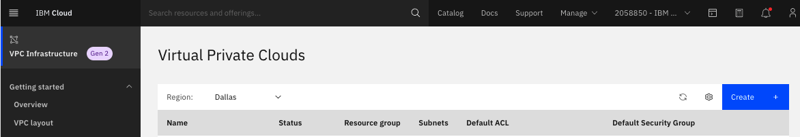

1. Click the `Create` button,

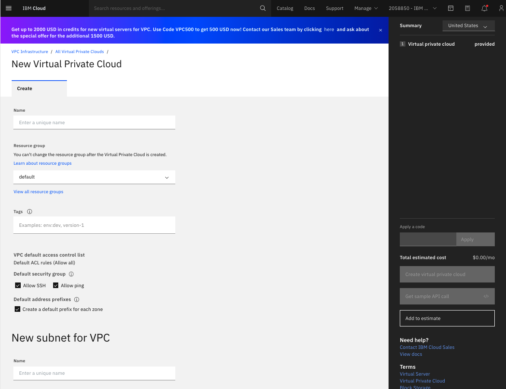

1. Edit the configuration of the new VPC,
    1. Enter a `Name` for the VPC: $USERNAME-vpc-ussouth2-1
    1. Select a `Resource group`: $USERNAME-rg
    1. Add `Tags`: $USERNAME, vpc1, tutorial
    1. `Default ACL Rules` are set to `Allow all`
    1. In the `Default security group`, check `Allow SSH` and `Allow ping`
    1. Check `Create a default prefix for each zone`,
    1. Enter a `Name` for the `New subnet for VPC`: $USERNAME-subnet-ussouth2-1
    1. Select a `Resource group`: $USERNAME-rg
    1. For `Location`, select `Dallas` and select `Dallas 2`
    1. In the `IP range selection`, accept all defaults, enable the `Public gateway` switch to `Attached`

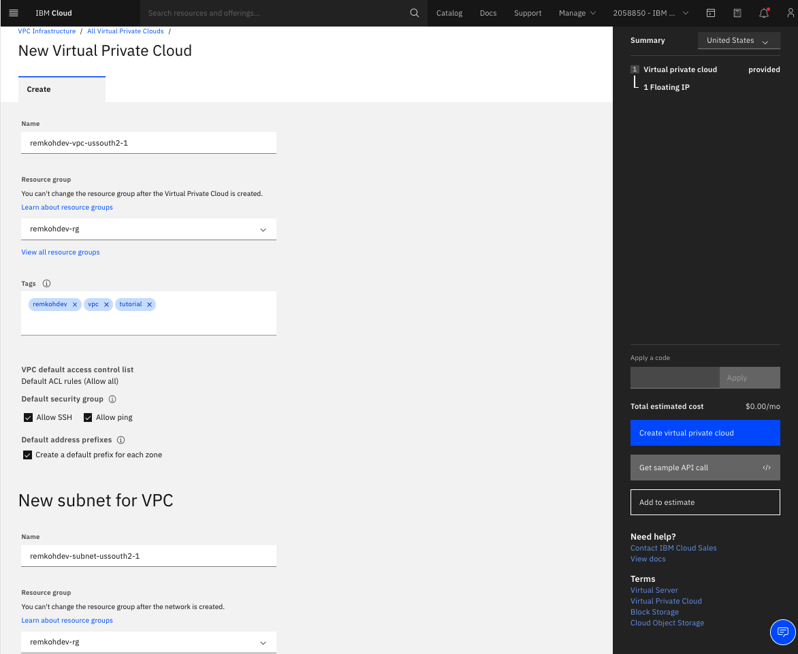

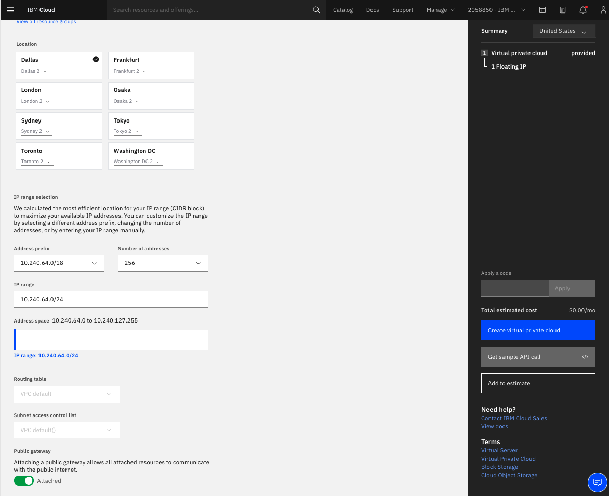

1. In the right panel, click `Create virtual private cloud`,
1. The Virtual Private Clouds list will load,
1. Locate the VPC you just created and click the linked name of your VPC,
1. The VPC Overview page loads,

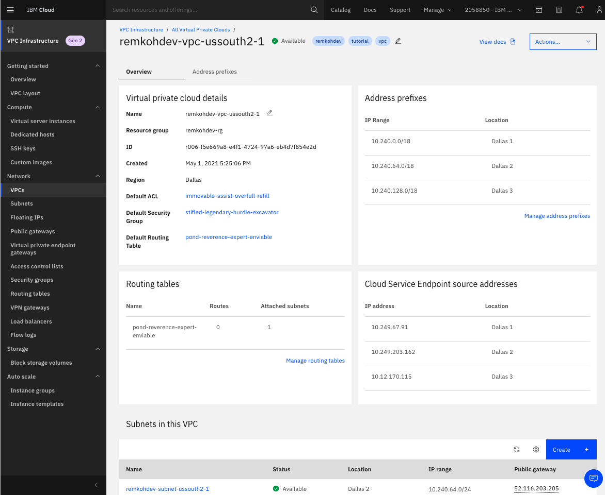

## Create an Additional Subnet

TODO create subnet $USERNAME-subnet-ussouth3-2

## Create Object Storage

TODO create `$USERNAME-cos-1`

## Create an OpenShift Cluster

1. Select the `Containers` Category in the [IBM Cloud Catalog](https://cloud.ibm.com/catalog?category=containers#services),

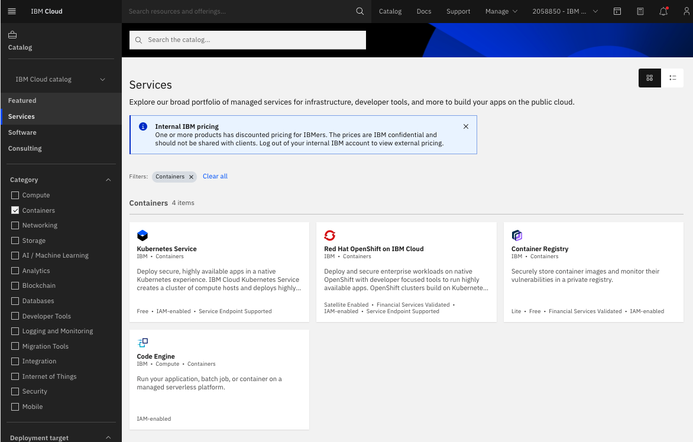

1. Select the tile for `Red Hat OpenShift` on IBM Cloud, note that this service is tagged as `Satellite Enabled`, `Financial Services Validated`, `IAM-Enabled`, and `Service Endpoint Supported`,

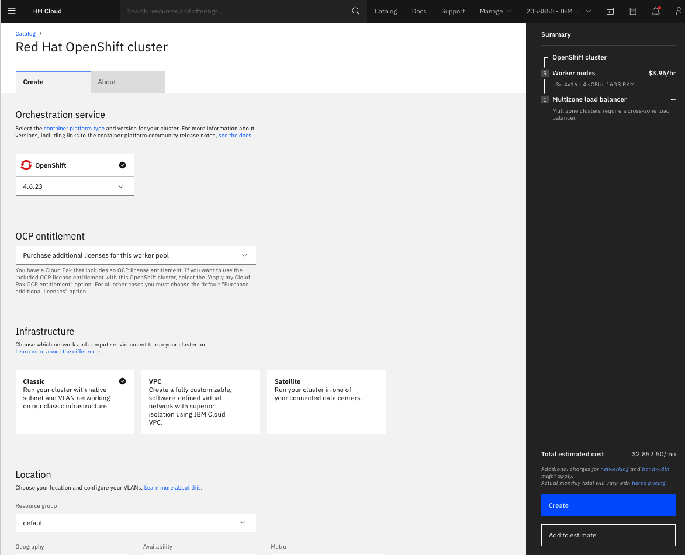

1. Select the openShift version, e.g. 4.6.x
1. Select your OCP entitlement,
1. For `Infrastructure` select `VPC`, which will load your existing VPC infrastructure,
1. In `Virtual private cloud`, select the VPC you created above or another existing VPC to attach your cluster to, e.g. `$USERNAME-vpc-ussouth2-1`,
1. In `Cloud Object Storage`, select the Cloud Object Storage instance you created above or another existing Cloud Object Storage instance, e.g. `$USERNAME-cos-1`,

1. Under `Location`, select the same `Resource group` as for the VPC resource group, $USERNAME-rg,
1. For `Worker zones`, available subnets will be loaded. Select `$USERNAME-subnet-ussouth2-1` in `Dallas 2`, uncheck zones without subnet and subnets you do not want to use,
1. Select your flavor or node configuration, e.g. `bx2.4x16` with 4 vCPU, 16GB Memory, using RHEL nodes,
1. Select number of `Worker nodes per zone`, e.g. 3
1. Name your worker pool, e.g. `$USERNAME-worker-pool-ussouth-1`
1. Select the master service endpoints, choose `Private endpoint only` to access your cluster via the private network or VPN tunnel,
1. Under `Resource details`, enter a `Cluster name`, e.g. `$USERNAME-roks46-3n-tutorial-cl1`
1. Add `Tags`: $USERNAME, vpc1, tutorial

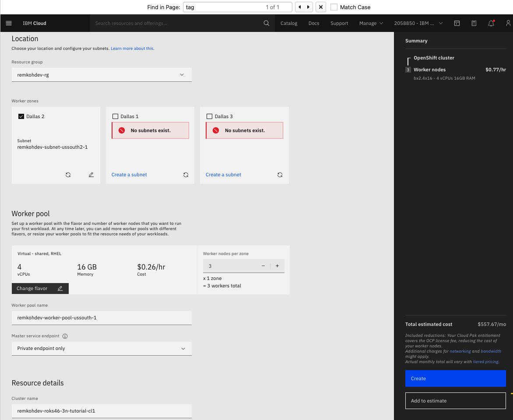

1. In the right column, review your configuration, the estimated cost and to accept, click the `Create` button,

TODO: check popup notification
"Your cluster order is complete and your cluster is creating. However, some related components need your attention:

If your cluster runs Kubernetes version 1.18 or earlier, the default security group 'stifled-legendary-hurdle-excavator' (ID 'r006-1bb65293-c287-4bb9-9783-14ee2f83488f') for VPC 'remkohdev-vpc-ussouth2-1' (ID 'r006-f5e669a8-e4f1-4724-97a6-eb4d7f854e2d') must be edited to allow incoming network traffic from the VPC load balancers. For more info, see [http://ibm.biz/vpc-sgs"](http://ibm.biz/vpc-sgs").

1. The cluster order is created and the new cluster `Access` page will load,

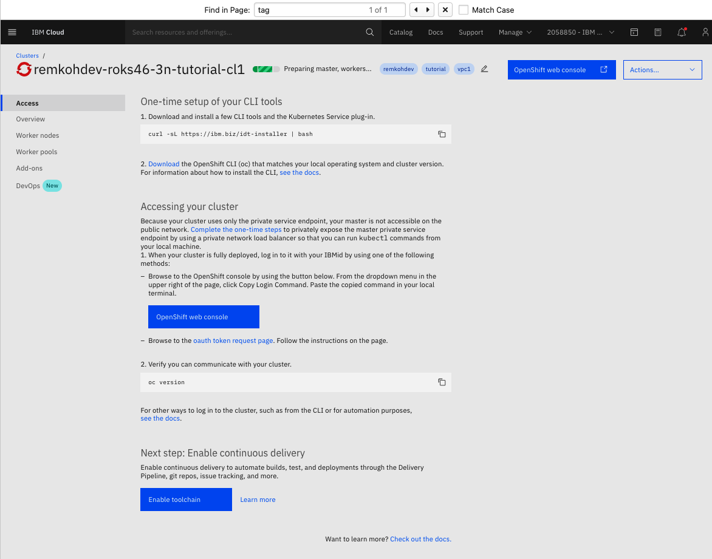

1. Click the `Overview` link, wait until cluster creation has completed, you should be seeing the `Ingress Subdomain` appear,

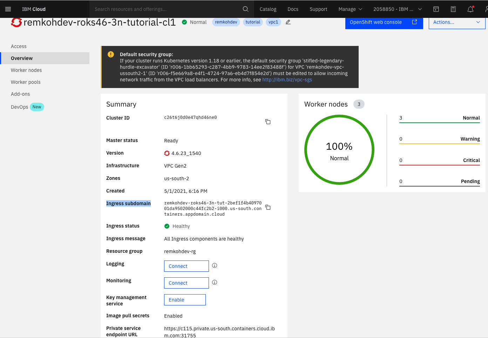

1. From the IBM Cloud drop down menu in the top left of your page, browse to `VPC Infrastructure`, `VPCs`,

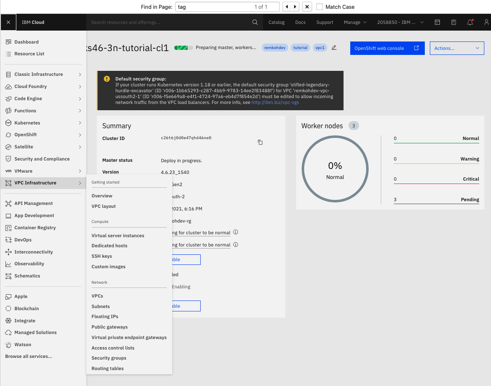

1. Go to subnet,
1. A `Virtual private endpoint gateway for VPC` was created
