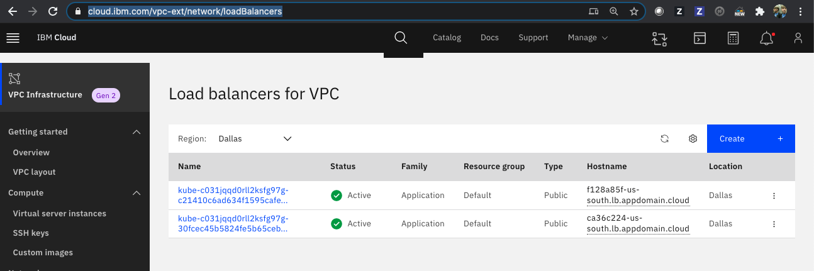

# Create a Kubernetes Cluster for VPC

Create a cluster in your VPC in the same zone as the subnet. By default, your cluster is created with a public and a private service endpoint. You can use the public service endpoint to access the Kubernetes master.

Create the cluster in the VPC,

```bash
$ ibmcloud ks cluster create vpc-gen2 --flavor bx2.2x8 --name $MY_CLUSTER_NAME --subnet-id $MY_VPC_SUBNET_ID --vpc-id $MY_VPC_ID --zone $MY_ZONE --version $KS_VERSION --workers 1

Creating cluster...
OK
Cluster created with ID bvglln7d0e5j0u9lfa80
```

Review your [IBM Cloud account resources](https://cloud.ibm.com/resources).


Find your cluster and click the linked cluster name of the cluster you just created. If you do not see the cluster listed yet, wait and refresh the page. 


Check the status of the new cluster,

```bash
ibmcloud ks clusters

MY_CLUSTER_ID=$(ibmcloud ks clusters --output json --provider vpc-gen2 | jq -r '.[] | select( .name=='\"$MY_CLUSTER_NAME\"') | .id ')
echo $MY_CLUSTER_ID
```

To continue with the next step, the cluster status and the Ingress status must indicate to be available. The cluster might take about 15 minutes to complete.

```bash
$ ibmcloud ks cluster get --cluster $MY_CLUSTER_ID

Retrieving cluster c57pqakd0fk24fuesujg...OK
                                   Name:                           bnewell-iks120-vpc-cl1   ID:                             c57pqakd0fk24fuesujg   State:                          deploying   
Status:                         -   Created:                        2021-09-25 22:05:30 +0000 (8 minutes ago)   
Resource Group ID:              0d71b6d02dba487a9826cc7e5c546dd0   
Resource Group Name:            bnewell-vpc-rg   
Pod Subnet:                     172.17.0.0/18   
Service Subnet:                 172.21.0.0/16   
Workers:                        1   
Worker Zones:                   us-south-1   
Ingress Subdomain:              - †   
Ingress Secret:                 - †   
Ingress Status:                 -   
Ingress Message:                -   
Public Service Endpoint URL:    -   
Private Service Endpoint URL:   -   
Pull Secrets:                   enabled in the default namespace   
VPCs:                           r006-ae17b5d4-56b9-4dac-88dd-85fc3aa530ac   

Master         
Status:     Deploy in progress. (7 minutes ago)   
State:      deploying   
Health:     -   
Version:    1.20.10_1550   
Location:   Dallas   
URL:        -   
† Your Ingress subdomain and secret might not be ready yet. For more info by cluster type, see 'https://ibm.biz/ingress-sub' for Kubernetes or 'https://ibm.biz/ingress-sub-ocp' for OpenShift.
```

Once the cluster is fully provisioned including the Ingress Application Load Balancer (ALB), you should see the `Worker nodes` status to be `100% Normal`, the `Ingress subdomain` should be populated, among other,


Or via the CLI,

```bash
$ ibmcloud ks cluster get --cluster $MY_CLUSTER_ID
Retrieving cluster c57pqakd0fk24fuesujg...
OK
                                   
Name:                           remkohdev-iks120-vpc-cl1   
ID:                             c57pqakd0fk24fuesujg   
State:                          normal   
Status:                         All Workers Normal   
Created:                        2021-09-25 22:05:30 +0000 (50 minutes ago)   
Resource Group ID:              0d71b6d02dba487a9826cc7e5c546dd0   
Resource Group Name:            remkohdev-vpc-rg   
Pod Subnet:                     172.17.0.0/18   
Service Subnet:                 172.21.0.0/16   
Workers:                        1   
Worker Zones:                   us-south-1   
Ingress Subdomain:              remkohdev-iks120-vpc-cl1-2bef1f4b4097001da9502000c44fc2b2-0000.us-south.containers.appdomain.cloud   
Ingress Secret:                 remkohdev-iks120-vpc-cl1-2bef1f4b4097001da9502000c44fc2b2-0000   
Ingress Status:                 warning   
Ingress Message:                One or more ALBs are unhealthy. See http://ibm.biz/ingress-alb-check   
Public Service Endpoint URL:    https://c127.us-south.containers.cloud.ibm.com:31169   
Private Service Endpoint URL:   https://c127.private.us-south.containers.cloud.ibm.com:31169   
Pull Secrets:                   enabled in the default namespace   
VPCs:                           r006-ae17b5d4-56b9-4dac-88dd-85fc3aa530ac   

Master         
Status:     Ready (13 minutes ago)   
State:      deployed   
Health:     normal   
Version:    1.20.10_1550   
Location:   Dallas   
URL:        https://c127.us-south.containers.cloud.ibm.com:31169
```

You can also check the status of the Application Load Balancer (ALB),

```console
$ ibmcloud ks ingress alb ls --cluster $MY_CLUSTER_ID

OK
ALB ID                                Enabled   State      Type      Load Balancer Hostname                 Zone         Build                                  Status   
private-crc57pqakd0fk24fuesujg-alb1   false     disabled   private   -                                      us-south-1   ingress:/ingress-auth:                 disabled   
public-crc57pqakd0fk24fuesujg-alb1    true      enabled    public    62809e32-us-south.lb.appdomain.cloud   us-south-1   ingress:1.0.0_1699_iks/ingress-auth:   healthy    
```

## Deploy the Guestbook Application

Now the cluster is fully provisioned successfully, you can connect to your cluster and set the `current-context` of the `kubectl`,

```bash
ibmcloud ks cluster config --cluster $MY_CLUSTER_ID
kubectl config current-context
```

If you have multiple configuration and contexts, you can easily switch between contexts,

```bash
kubectl config use-context $MY_CLUSTER_NAME/$MY_CLUSTER_ID
```

Deploy the guestbook application,

```console
kubectl create namespace $MY_NAMESPACE
kubectl create deployment guestbook --image=ibmcom/guestbook:v1 -n $MY_NAMESPACE
kubectl expose deployment guestbook --type="LoadBalancer" --port=3000 --target-port=3000 -n $MY_NAMESPACE
```

List the created service for guestbook,

```bash
$ kubectl get svc -n $MY_NAMESPACE
NAME        TYPE           CLUSTER-IP       EXTERNAL-IP                            PORT(S)          AGE
guestbook   LoadBalancer   172.21.139.220   b0384765-us-south.lb.appdomain.cloud   3000:32498/TCP   116s
```

Create environment variables for the public IP address of the `LoadBalancer` service, the `NodePort`, and the port,

```bash
SVC_EXTERNAL_IP=$(kubectl get svc -n $MY_NAMESPACE --output json | jq -r '.items[] | .status.loadBalancer.ingress[0].hostname ')
echo $SVC_EXTERNAL_IP

SVC_NODEPORT=$(kubectl get svc -n $MY_NAMESPACE --output json | jq -r '.items[].spec.ports[] | .nodePort')
echo $SVC_NODEPORT

SVC_PORT=$(kubectl get svc -n $MY_NAMESPACE --output json | jq -r '.items[].spec.ports[] | .port')
echo $SVC_PORT
```

**Note** the external IP address is set to the `hostname` of one of two `Load Balancers for VPC`. See the [Load balancers for VPC](https://cloud.ibm.com/vpc-ext/network/loadBalancers) in the IBM Cloud VPC Infrastructure listing.



Try to send a request to the guestbook application,

```bash
curl http://$SVC_EXTERNAL_IP:$SVC_PORT

url: (7) Failed to connect to b0384765-us-south.lb.appdomain.cloud port 32498: Connection timed out
```

Even if you have created a `LoadBalancer` service with an external IP, the service cannot be reached because the VPC does not include a rule to allow incoming or ingress traffic to the service.

## Update the Security Group

To allow any traffic to applications that are deployed on your cluster's worker nodes, you have to modify the VPC's default security group by ID.

Update the security group and add an inbound rule for the NodePort of the service you created when exposing the guestbook deployment. I only want to allow ingress traffic on the NodePort, so I set the minimum and maximum value of allowed inbound ports to the same NodePort value.

```bash
$ ibmcloud is security-group-rule-add $MY_DEFAULT_SG_ID inbound tcp --port-min $SVC_NODEPORT --port-max $SVC_NODEPORT

Creating rule for security group r006-3541d535-2c0d-4fac-8811-b6f4f0a76690 under account IBM Client Developer Advocacy as user bnewell@email.com...
                          
ID                     r006-b23ee8eb-1860-4c2b-b758-86ae0dea4f08   
Direction              inbound   
IP version             ipv4   
Protocol               tcp   
Min destination port   32498   
Max destination port   32498   
Remote                 0.0.0.0/0 
```

List all the security group rules,

```console
$ ibmcloud is security-group-rules $MY_DEFAULT_SG_ID

Listing rules of security group r006-3541d535-2c0d-4fac-8811-b6f4f0a76690 under account IBM Client Developer Advocacy as user bnewell@email.com...
ID                                          Direction   IP version   Protocol                        Remote   
r006-95a98531-df4c-4ac6-b8a0-3af8e8e4bb64   outbound    ipv4         all                             0.0.0.0/0   
r006-b0a5dd7b-e494-4829-8d7a-af391c903745   inbound     ipv4         all                             stadium-reemerge-vexingly-spotted   
r006-b23ee8eb-1860-4c2b-b758-86ae0dea4f08   inbound     ipv4         tcp Ports:Min=32498,Max=32498   0.0.0.0/0 
```

Or add a security group rule to allow inbound TCP traffic on all Kubernetes ports in the range of 30000–32767.

Try again to reach the guestbook application,

```console
$ curl http://$SVC_EXTERNAL_IP:$SVC_PORT/hello
Hello from guestbook. Your app is up! (Hostname: guestbook-58df645464-rscpd)
```

Or open the Guestbook in a browser,


If you want to understand better how the load balancing for VPC works, review the optional extra section [Understanding the Load Balancer for VPC](vpcgen2-loadbalancer.md)

You can try removing the inbound rule again to check if the VPC rejects the request again,

```bash
ibmcloud is security-group-rule-delete $MY_DEFAULT_SG_ID $MY_DEFAULT_SG_RULE_ID
```

## Conclusion

You are awesome! You secured your Kubernetes cluster with a Virtual Private Cloud (VPC), managing direct access to your cluster. Security is an important integral part of any software application development and `airgapping` your cluster by adding a VPC is a first step in securing your cluster, network and other resources.

## Next

Next, [Cleanup](3_cleanup.md) the resources you created or go back to [Kubernetes Networking](../README.md).
