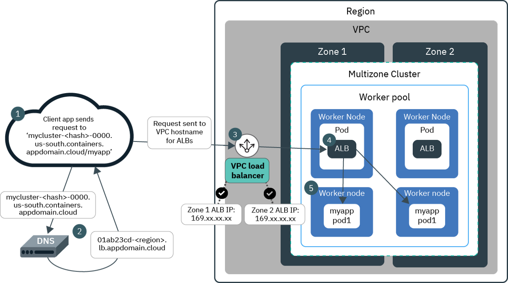

# Secure a Kubernetes Cluster with VPC Gen2

This tutorial explains how to get started with an `air-gap` and secure an OpenShift or Kubernetes cluster and physically isolate our cluster network. Measured by strict industry specific controls for `airgapping` a network, like the Financial Services industry, this tutorial does not airgap the cluster. To airgap a cluster by more strict standards additional measures are needed. For more information about `air-gap`, go [here](airgap.md).

## Prerequirements

* Free IBM Cloud account, for new account registration go [here](https://ibm.github.io/workshop-setup/NEWACCOUNT/), 
* Upgrade to free Pay-As-You-Go account, for upgrade go [here](https://ibm.github.io/workshop-setup/PAYASYOUGO/),
* Client terminal at CognitiveClass.ai, for setup go [here](https://ibm.github.io/workshop-setup/COGNITIVECLASS/).

## Airgap

Using an air gapped cluster is one of the foundational best practices for creating secure container deployments. You can air gap your cluster by creating a Virtual Private Cloud (VPC) and add rules to a Security Group of an Application Load Balancer (ALB) to allow certain inbound traffic where needed or add a gateway like API Connect to the VPC and expose the gateway to manage traffic, for instance with rate limit and API key access control.

With Red Hat OpenShift Kubernetes (ROKS) or IBM Cloud Kubernetes Service (IKS) on VPC Generation 2 Computeon IBM Cloud, you can create an OpenShift or Kubernetes cluster on a Virtual Private Cloud (VPC) infrastructure in a matter of minutes. OpenShift is the more enterprise-ready secure Container Orchestration (CO) platform, but in this tutorial I use a plain managed Kubernetes service because for most beginners this will be more accessible and affordable. If you want however, you can choose to use OpenShift instead.

This tutorial uses a free IBM Cloud account, free IKS service on IBM Cloud with a free Pay-As-You-Go account. This tutorial is based in parts on the official documentation for creating a cluster in your Virtual Private Cloud (VPC) on generation 2 compute.

Steps:

1. Setup,
2. (Skip) Using UI to Create a Cluster with VPC Generation 2 Compute
3. Using CLI to Create a Cluster with VPC Generation 2 Compute
4. Create a Kubernetes Cluster
5. Deploy the Guestbook Application,
6. Update the Security Group
7. Understanding the Load Balancer
8. Ingress Application Load Balancer (ALB)
9. Cleanup

## Setup

Add the VPC infrastructure service plug-in to the IBM Cloud CLI in the client terminal,

```
ibmcloud plugin install infrastructure-service
```

Set the following environment variables to be used in the remainder of the tutorial. Set the USERNAME to a unique value shorter than 10 characters and set the IBMID to the email you used to create the IBM Cloud account. The other variables don't need to be changed but you can choose to rename them if you prefer.

```
USERNAME=<bnewell>
IBMID=<b.newell2@remkoh.dev>

MY_REGION=us-south
MY_ZONE=$MY_REGION-1
MY_VPC_NAME=$USERNAME-vpcgen2-vpc1
MY_VPC_SUBNET_NAME=$USERNAME-vpcsubnet1
MY_PUBLIC_GATEWAY=$USERNAME-public-gateway1
MY_CLUSTER_NAME=$USERNAME-iks118-vpc-cluster1
KS_VERSION=1.18
MY_NAMESPACE=my-guestbook
```

Log in to the IBM Cloud account, if you use a Single Sign-On (SSO) provider, use the --sso flag instead of the username flag.

```
ibmcloud login -u $IBMID [--sso]
```

Target the region where you want to create your VPC environment. The resource group flag is optional, if you happen to know it, you can target it explicitly, but this tutorial does not use it.

```
ibmcloud target -r $MY_REGION [-g <resource_group>]
```

The VPC must be set up in the same multi-zone metro location where you want to create your cluster. Target generation 2 infrastructure.

```
ibmcloud is target --gen 2
```

## Using UI to Create a Cluster with VPC Generation 2 Compute

This section uses the browser to create the cluster and VPC. I always prefer the command line or CLI instead because this forces me to write the commands that allow me to automate the whole process and to think of everything as code. If you want to use the CLI, skip to the next section.

Using the UI, create an IBM Cloud Kubernetes Service (IKS), for infrastructure provider choose Generation 2 Compute instead of Classic. For a comparison of infrastructure providers, read Supported Infrastructure Providers, or read an Overview of VPC Networking in IBM Cloud Kubernetes Service (IKS).

(dd. December 2020) This will setup the following infrastructure for you:

1. Virtual Private Cloud, watch this good primer on VPC by Ryan Sumner,
1. Subnet,
1. Security Group,
an Access Control List (ACL),
1. Public Gateway with a Floating IP for Public Access,
1. an encrypted VPN Gateway or a Direct Link Private Circuits for Private Access,
1. an elastic Load Balancer for VPC, using an Application Load Balancer (ALB), which includes Sysdig monitoring, Hihg Availability (HA) with a Domain Name Server (DNS), Multi-Zone Region (MZR) support, L4 network layer and L7 application layer support, both public and private load balancing.

## Using CLI to Create a Cluster with VPC Generation 2 Compute

This section uses the IBM Cloud CLI to create a cluster in your VPC on generation 2 compute.

Create a VPC and a subnet,

```
ibmcloud is vpc-create $MY_VPC_NAME
ibmcloud is vpcs

ID    Name    Status    Classic access Default network ACL Default security group Resource group 
r006–3883b334–1f4e-4d6a-b3b7–343a029d81bc remkohdev-vpcgen2-vpc1 available false prowling-prevail-universe-equivocal hatracks-fraying-unloader-prevail default

MY_VPC_ID=$(ibmcloud is vpcs --output json | jq -r '.[] | select( .name=='\"$MY_VPC_NAME\"') | .id ')
echo $MY_VPC_ID

ibmcloud is subnet-create $MY_VPC_SUBNET_NAME $MY_VPC_ID --zone $MY_ZONE --ipv4-address-count 256

MY_VPC_SUBNET_ID=$(ibmcloud is subnets --output json | jq -r '.[] | select( .name=='\"$MY_VPC_SUBNET_NAME\"') | .id ')
echo $MY_VPC_SUBNET_ID
```

Inspect the VPC's default security group,

```
MY_DEFAULT_SG_NAME=$(ibmcloud is vpcs --output json | jq -r '.[] | select( .name=='\"$MY_VPC_NAME\"') | .default_security_group.name ')
echo $MY_DEFAULT_SG_NAME

MY_DEFAULT_SG_ID=$(ibmcloud is security-groups --output json | jq -r '.[] | select( .name=='\"$MY_DEFAULT_SG_NAME\"') | .id ')
echo $MY_DEFAULT_SG_ID

ibmcloud is security-group $MY_DEFAULT_SG_ID --output json

{
    "created_at": "2020-12-18T22:54:04.000Z",
    "crn": "crn:v1:bluemix:public:is:us-south:a/e65910fa61ce9072d64902d03f3d4774::security-group:r006-e201e996-c849-4d0c-ae41-97e4c303d219",
    "href": "https://us-south.iaas.cloud.ibm.com/v1/security_groups/r006-e201e996-c849-4d0c-ae41-97e4c303d219",
    "id": "r006-e201e996-c849-4d0c-ae41-97e4c303d219",
    "name": "hatracks-fraying-unloader-prevail",
    "network_interfaces": [
        {
            "deleted": {
                "more_info": null
            },
            "href": "https://us-south.iaas.cloud.ibm.com/v1/instances/0717_2ba757dd-0d40-48c6-b72e-6fb2ea12584a/network_interfaces/0717-57f73998-6af6-43e1-981f-698f021f4842",
            "id": "0717-57f73998-6af6-43e1-981f-698f021f4842",
            "name": "unpleased-urethane-recycled-subduing",
            "primary_ipv4_address": "10.240.0.4",
            "resource_type": "network_interface"
        },
        {
            "deleted": {
                "more_info": null
            },
            "href": "https://us-south.iaas.cloud.ibm.com/v1/instances/0717_3affef2d-c4b7-49e0-a785-c65ad2f64a35/network_interfaces/0717-0dc82474-6b74-48e7-89e7-536994a45524",
            "id": "0717-0dc82474-6b74-48e7-89e7-536994a45524",
            "name": "sweep-timpani-unable-stricken",
            "primary_ipv4_address": "10.240.0.5",
            "resource_type": "network_interface"
        }
    ],
    "resource_group": {
        "href": "https://resource-controller.cloud.ibm.com/v2/resource_groups/fdd290732f7d47909181a189494e2990",
        "id": "fdd290732f7d47909181a189494e2990",
        "name": "default"
    },
    "rules": [
        {
            "direction": "outbound",
            "id": "r006-c0b88082-748c-47a8-bc75-c9aabb3da4e3",
            "ip_version": "ipv4",
            "protocol": "all",
            "remote": {
                "cidr_block": "0.0.0.0/0"
            }
        },
        {
            "direction": "inbound",
            "id": "r006-4693fcb0-2998-4d73-b62f-9dd80fe1ac56",
            "ip_version": "ipv4",
            "protocol": "all",
            "remote": {
                "href": "https://us-south.iaas.cloud.ibm.com/v1/security_groups/r006-e201e996-c849-4d0c-ae41-97e4c303d219",
                "id": "r006-e201e996-c849-4d0c-ae41-97e4c303d219",
                "name": "hatracks-fraying-unloader-prevail"
            }
        },
        {
            "direction": "inbound",
            "id": "r006-b0fb17d4-b858-4a1f-bb8c-24231f527155",
            "ip_version": "ipv4",
            "port_max": 22,
            "port_min": 22,
            "protocol": "tcp",
            "remote": {
                "cidr_block": "0.0.0.0/0"
            }
        },
        {
            "direction": "inbound",
            "id": "r006-87a1f11b-6d30-4d63-84df-1bda1c5e25f2",
            "ip_version": "ipv4",
            "protocol": "icmp",
            "remote": {
                "cidr_block": "0.0.0.0/0"
            },
            "type": 8
        },
        {
            "direction": "inbound",
            "id": "r006-ade5f825-49e0-47bf-b6cf-b020b5fa23b8",
            "ip_version": "ipv4",
            "port_max": 80,
            "port_min": 80,
            "protocol": "tcp",
            "remote": {
                "cidr_block": "0.0.0.0/0"
            }
        }
    ],
    "targets": null,
    "vpc": {
        "crn": "crn:v1:bluemix:public:is:us-south:a/e65910fa61ce9072d64902d03f3d4774::vpc:r006-3883b334-1f4e-4d6a-b3b7-343a029d81bc",
        "href": "https://us-south.iaas.cloud.ibm.com/v1/vpcs/r006-3883b334-1f4e-4d6a-b3b7-343a029d81bc",
        "id": "r006-3883b334-1f4e-4d6a-b3b7-343a029d81bc",
        "name": "remkohdev-vpcgen2-vpc1"
    }
}
```

Create and attach a public gateway, this should create a floating IP for your public gateway attached to your subnet,

```
ibmcloud is public-gateway-create $MY_PUBLIC_GATEWAY $MY_VPC_ID $MY_ZONE
MY_PUBLIC_GATEWAY_ID=$(ibmcloud is public-gateways --output json | jq -r '.[] | select( .name=='\"$MY_PUBLIC_GATEWAY\"') | .id')
echo $MY_PUBLIC_GATEWAY_ID

MY_PUBLIC_GATEWAY_ID2=$(ibmcloud is subnets --output json | jq -r '.[] | select( .name=='\"$MY_VPC_SUBNET_NAME\"') | .public_gateway.id ')
echo $MY_PUBLIC_GATEWAY_ID2

ibmcloud is subnet-update $MY_VPC_SUBNET_ID --public-gateway-id $MY_PUBLIC_GATEWAY_ID

MY_FLOATING_IP=$(ibmcloud is subnet-public-gateway $MY_VPC_SUBNET_ID --output json | jq -r '.floating_ip.address')
echo $MY_FLOATING_IP
```

Go to your subnets for VPC, click the linked subnet name you just created to view the new subnet details, it should include a floating IP,

## Create a Kubernetes Cluster

Create a cluster in your VPC in the same zone as the subnet. By default, your cluster is created with a public and a private service endpoint. You can use the public service endpoint to access the Kubernetes master,

```
ibmcloud ks zone ls --provider vpc-gen2
ibmcloud ks versions
ibmcloud ks cluster create vpc-gen2 --name $MY_CLUSTER_NAME --zone $MY_ZONE --version $KS_VERSION --flavor bx2.2x8 --workers 1 --vpc-id $MY_VPC_ID --subnet-id $MY_VPC_SUBNET_ID

Creating cluster...
OK
Cluster created with ID bvglln7d0e5j0u9lfa80
```

Review your IBM Cloud account resources,

Click the linked cluster name of the cluster you just created. If you do not see the cluster listed yet, wait and refresh the page. Check the status of the new cluster,

```
ibmcloud ks clusters
MY_CLUSTER_ID=$(ibmcloud ks clusters --output json --provider vpc-gen2 | jq -r '.[] | select( .name=='\"$MY_CLUSTER_NAME\"') | .id ')
```

## Deploy the Guestbook Application

Connect to your cluster to set the current-context,

```
ibmcloud ks cluster config --cluster $MY_CLUSTER_ID
kubectl config current-context
```

Deploy the guestbook application,

```
kubectl create namespace $MY_NAMESPACE
kubectl create deployment guestbook --image=ibmcom/guestbook:v1 -n $MY_NAMESPACE
kubectl expose deployment guestbook --type="LoadBalancer" --port=3000 --target-port=3000 -n $MY_NAMESPACE
kubectl get svc -n $MY_NAMESPACE

NAME        TYPE           CLUSTER-IP     EXTERNAL-IP                            PORT(S)          AGE
guestbook   LoadBalancer   172.21.48.26   7a6a66a7-us-south.lb.appdomain.cloud   3000:32308/TCP   31m

SVC_EXTERNAL_IP=$(kubectl get svc -n $MY_NAMESPACE --output json | jq -r '.items[] | .status.loadBalancer.ingress[0].hostname ')
echo $SVC_EXTERNAL_IP

SVC_NODEPORT=$(kubectl get svc -n $MY_NAMESPACE --output json | jq -r '.items[].spec.ports[] | .nodePort')
echo $SVC_NODEPORT

SVC_PORT=$(kubectl get svc -n $MY_NAMESPACE --output json | jq -r '.items[].spec.ports[] | .port')
echo $SVC_PORT
```

Try to send a request to the guestbook application,

```
curl http://$SVC_EXTERNAL_IP:$SVC_PORT

curl: (52) Empty reply from server
```

## Update the Security Group

To allow any traffic to applications that are deployed on your cluster's worker nodes, you have to modify the VPC's default security group by ID.

Update security group and add an inbound rule for NodePort of the service you created when exposing the guestbook deployment,

```
ibmcloud is security-group-rule-add $MY_DEFAULT_SG_ID inbound tcp --port-min $SVC_NODEPORT --port-max $SVC_NODEPORT

Creating rule for security group r006-b4f498ea-1e71-489e-95f0-0e64cf8d520f under account Remko de Knikker as user b.newell2@remkoh.dev...
                          
ID                     r006-26b196de-5e3a-4a7d-b5fb-9baf9173feb7   
Direction              inbound   
IP version             ipv4   
Protocol               tcp   
Min destination port   32308   
Max destination port   32308   
Remote                 0.0.0.0/0

ibmcloud is security-group-rules $MY_DEFAULT_SG_ID

Listing rules of security group r006-b4f498ea-1e71-489e-95f0-0e64cf8d520f under account Remko de Knikker as user b.newell2@remkoh.dev...
ID                                          Direction   IP version   Protocol                        Remote   
r006-6c281868-cfbd-46d1-b714-81e085ae2b85   outbound    ipv4         all                             0.0.0.0/0   
r006-b07bbf77-84a0-4e35-90b7-5422f035cf1e   inbound     ipv4         all                             compacted-imprison-clinic-support   
r006-26b196de-5e3a-4a7d-b5fb-9baf9173feb7   inbound     ipv4         tcp Ports:Min=32308,Max=32308   0.0.0.0/0
```

Or add a security group rule to allow inbound TCP traffic on all Kubernetes ports in the range of 30000–32767.

Try again to reach the guestbook application,

```
curl http://$SVC_EXTERNAL_IP:$SVC_PORT
```

You should now be able to see the HTML response object from the Guestbook application. Open the guestbook URL in a browser to review the web page.

## Understanding the Load Balancer

Right now, the most important thing is that our tutorial works. Oof. You secured your Kubernetes cluster with a Virtual Private Cloud (VPC) and essentially so-called air-gapped the cluster, blocking direct access to your cluster.

To better understand what exactly happened in the end, especially to see why we are using the port of the Service object instead of the NodePort which is the port we allowed inbound traffic on, let's inspect the Service resource of the Guestbook deployment in more detail.

```
kubectl get svc -n $MY_NAMESPACE --output json 

{
    "apiVersion": "v1",
    "items": [
        {
            "apiVersion": "v1",
            "kind": "Service",
            "metadata": {
                "creationTimestamp": "2020-12-23T03:08:27Z",
                "finalizers": [
                    "service.kubernetes.io/load-balancer-cleanup"
                ],
                "labels": {
                    "app": "guestbook"
                },
                "managedFields": [
                    {
                        "apiVersion": "v1",
                        "fieldsType": "FieldsV1",
                        "fieldsV1": {
                            "f:metadata": {
                                "f:labels": {
                                    ".": {},
                                    "f:app": {}
                                }
                            },
                            "f:spec": {
                                "f:externalTrafficPolicy": {},
                                "f:ports": {
                                    ".": {},
                                    "k:{\"port\":3000,\"protocol\":\"TCP\"}": {
                                        ".": {},
                                        "f:port": {},
                                        "f:protocol": {},
                                        "f:targetPort": {}
                                    }
                                },
                                "f:selector": {
                                    ".": {},
                                    "f:app": {}
                                },
                                "f:sessionAffinity": {},
                                "f:type": {}
                            }
                        },
                        "manager": "kubectl-expose",
                        "operation": "Update",
                        "time": "2020-12-23T03:08:26Z"
                    },
                    {
                        "apiVersion": "v1",
                        "fieldsType": "FieldsV1",
                        "fieldsV1": {
                            "f:metadata": {
                                "f:finalizers": {
                                    ".": {},
                                    "v:\"service.kubernetes.io/load-balancer-cleanup\"": {}
                                }
                            },
                            "f:status": {
                                "f:loadBalancer": {
                                    "f:ingress": {}
                                }
                            }
                        },
                        "manager": "ibm-cloud-controller-manager",
                        "operation": "Update",
                        "time": "2020-12-23T03:29:13Z"
                    }
                ],
                "name": "guestbook",
                "namespace": "my-guestbook",
                "resourceVersion": "6502",
                "selfLink": "/api/v1/namespaces/my-guestbook/services/guestbook",
                "uid": "22bf711e-08e0-4827-8299-53a008b52481"
            },
            "spec": {
                "clusterIP": "172.21.48.26",
                "externalTrafficPolicy": "Cluster",
                "ports": [
                    {
                        "nodePort": 32308,
                        "port": 3000,
                        "protocol": "TCP",
                        "targetPort": 3000
                    }
                ],
                "selector": {
                    "app": "guestbook"
                },
                "sessionAffinity": "None",
                "type": "LoadBalancer"
            },
            "status": {
                "loadBalancer": {
                    "ingress": [
                        {
                            "hostname": "7a6a66a7-us-south.lb.appdomain.cloud"
                        }
                    ]
                }
            }
        }
    ],
    "kind": "List",
    "metadata": {
        "resourceVersion": "",
        "selfLink": ""
    }
}
```

**Note:** Service resource lists a property status.loadBalancer.ingress with hostname. We used the hostname to access the Guestbook Service.
spec.ports.port is the port on which the service listens for external network traffic. The `externalTrafficPolicy` property is set to Cluster, which always routes traffic to all pods running a service with equal distribution.
we used a Service type of LoadBalancer.

## Ingress Application Load Balancer (ALB)

Ingress is a Kubernetes service that balances network traffic workloads in your cluster by forwarding public or private requests to your apps by using a unique public or private route. The Ingress application load balancer (ALB) is a layer 7 (L7) load balancer, which implements the NGINX Ingress controller. A layer 4 (L4) LoadBalancer service exposes the ALB so that the ALB can receive external requests that come into your cluster.

An `Ingress` deployment consists of three components:

* Ingress resources,
* an internal L7 Application Load Balancer (ALB),
* an external L4 load balancer to handle incoming requests across zones. For classic clusters, this component is the Multi-Zone Load Balancer (MZLB) that IBM Cloud Kubernetes Service creates for you. For VPC clusters, this component is the VPC load balancer created in your VPC.

To expose an app by using Ingress, you must create a Kubernetes service for your app and register this service with Ingress by defining an Ingress resource. (To learn how, go to [Ingress and ALB](ingress-alb.md)). 

The following diagram shows how Ingress directs communication from the internet to an app in a VPC multizone cluster.


[source](https://cloud.ibm.com/docs/containers?topic=containers-ingress-about#architecture-vpc)

A VPC load balancer listens for external traffic, and based on the resolved IP address, the VPC load balancer sends the request to an available Application Load Balancer (ALB). The Application Load Balancer (ALB) listens for incoming HTTP, HTTPS, or TCP service requests, checks if routing rules exist for the application, and then forwards requests to the appropriate app pod according to the rules defined in the Ingress resource. 

In the IKS instance, there is a private and a public Ingress ALB installed, the private Ingress ALB is disabled.

```
ibmcloud ks ingress alb ls -c $MY_CLUSTER_NAME

OK
ALB ID    Enabled    State    Type    Load Balancer Hostname    Zone    Build    Status   
private-crbvhau5gd0do97g1vvo50-alb1    false    disabled    private    -    us-south-1    ingress:/ingress-auth:     -    
public-crbvhau5gd0do97g1vvo50-alb1    true    enabled    public    1e7d00e2-us-south.lb.appdomain.cloud    us-south-1    ingress:0.35.0_826_iks/ingress-auth:    -
```

List the VPC Load Balancers that were created,

```
ibmcloud is load-balancers

Listing load balancers for generation 2 compute in all resource groups and region us-south under account Remko de Knikker as user b.newell2@remkoh.dev...

ID    Name    Family    Subnets    Is public    Provision status    Operating status    Resource group
r006-1e7d00e2-cc50-4f5b-a12f-b5bcfa95c439    kube-bvhau5gd0do97g1vvo50-c974a95bc72740fba2839a191ba23e17    Application    remkohdev-vpcsubnet1    true    active    online    Default    
r006-7a6a66a7-9871-473e-b105-20640caa0f77    kube-bvhau5gd0do97g1vvo50-22bf711e08e04827829953a008b52481    Application    remkohdev-vpcsubnet1    true    active    online    Default
```

The `Family` property is listed as value `Application` (Application Load Balancer (ALB)) and the `Name` is listed as value `dynamic`. This means that IBM Cloud Application Load Balancer for VPC integrates with instance groups, which can auto scale your back-end members. Pool members are dynamically added and deleted based on your usage and requirements. Round-robin is the default load-balancing method, but you can also use weighted round-robin or least connections.

Inspect details for each VPC ALB and inspect Listeners, Pools and Pool Members,

```
MY_LOAD_BALANCER_ID=r006-7a6a66a7-9871-473e-b105-20640caa0f77
ibmcloud is load-balancer $MY_LOAD_BALANCER_ID --output json

{
    "created_at": "2020-12-23T03:29:11.831Z",
    "crn": "crn:v1:bluemix:public:is:us-south:a/31296e3a285f42fdadd51ce14beba65e::load-balancer:r006-7a6a66a7-9871-473e-b105-20640caa0f77",
    "hostname": "7a6a66a7-us-south.lb.appdomain.cloud",
    "href": "https://us-south.iaas.cloud.ibm.com/v1/load_balancers/r006-7a6a66a7-9871-473e-b105-20640caa0f77",
    "id": "r006-7a6a66a7-9871-473e-b105-20640caa0f77",
    "is_public": true,
    "listeners": [
        {
            "deleted": {
                "more_info": null
            },
            "href": "https://us-south.iaas.cloud.ibm.com/v1/load_balancers/r006-7a6a66a7-9871-473e-b105-20640caa0f77/listeners/r006-a7ca3e8f-e8d5-4ac4-8dcb-ce076dc2d01c",
            "id": "r006-a7ca3e8f-e8d5-4ac4-8dcb-ce076dc2d01c"
        }
    ],
    "logging": {
        "datapath": {
            "active": false
        }
    },
    "name": "kube-bvhau5gd0do97g1vvo50-22bf711e08e04827829953a008b52481",
    "operating_status": "online",
    "pools": [
        {
            "deleted": {
                "more_info": null
            },
            "href": "https://us-south.iaas.cloud.ibm.com/v1/load_balancers/r006-7a6a66a7-9871-473e-b105-20640caa0f77/pools/r006-338f0670-7a16-45e0-b42c-ca5f9a3bd492",
            "id": "r006-338f0670-7a16-45e0-b42c-ca5f9a3bd492",
            "name": "tcp-3000-32308"
        }
    ],
    "private_ips": [
        {
            "address": "10.240.0.7"
        },
        {
            "address": "10.240.0.8"
        }
    ],
    "profile": {
        "family": "Application",
        "href": "https://us-south.iaas.cloud.ibm.com/v1/load_balancer/profiles/dynamic",
        "name": "dynamic"
    },
    "provisioning_status": "active",
    "public_ips": [
        {
            "address": "52.116.134.164"
        },
        {
            "address": "52.116.142.235"
        }
    ],
    "resource_group": {
        "href": "https://resource-controller.cloud.ibm.com/v1/resource_groups/68af6383f717459686457a6434c4d19f",
        "id": "68af6383f717459686457a6434c4d19f",
        "name": "Default"
    },
    "security_groups": null,
    "subnets": [
        {
            "deleted": {
                "more_info": null
            },
            "href": "https://us-south.iaas.cloud.ibm.com/v1/subnets/0717-78f8f62d-7865-4547-8afd-6e6e3eb37f11",
            "id": "0717-78f8f62d-7865-4547-8afd-6e6e3eb37f11",
            "name": "remkohdev-vpcsubnet1"
        }
    ]
}

MYLOAD_BALANCER_LISTENER_ID=r006-a7ca3e8f-e8d5-4ac4-8dcb-ce076dc2d01c
ibmcloud is load-balancer-listener $MY_LOAD_BALANCER_ID $MYLOAD_BALANCER_LISTENER_ID --output json

{
    "created_at": "2020-12-23T03:29:12.078Z",
    "default_pool": {
        "deleted": {
            "more_info": null
        },
        "href": "https://us-south.iaas.cloud.ibm.com/v1/load_balancers/r006-7a6a66a7-9871-473e-b105-20640caa0f77/pools/r006-338f0670-7a16-45e0-b42c-ca5f9a3bd492",
        "id": "r006-338f0670-7a16-45e0-b42c-ca5f9a3bd492",
        "name": "tcp-3000-32308"
    },
    "href": "https://us-south.iaas.cloud.ibm.com/v1/load_balancers/r006-7a6a66a7-9871-473e-b105-20640caa0f77/listeners/r006-a7ca3e8f-e8d5-4ac4-8dcb-ce076dc2d01c",
    "id": "r006-a7ca3e8f-e8d5-4ac4-8dcb-ce076dc2d01c",
    "policies": null,
    "port": 3000,
    "protocol": "tcp",
    "provisioning_status": "active"
}

ibmcloud is load-balancer-pools $MY_LOAD_BALANCER_ID --output json

[
    {
        "algorithm": "round_robin",
        "created_at": "2020-12-23T03:29:11.957Z",
        "health_monitor": {
            "delay": 5,
            "max_retries": 2,
            "port": 32308,
            "timeout": 2,
            "type": "tcp"
        },
        "href": "https://us-south.iaas.cloud.ibm.com/v1/load_balancers/r006-7a6a66a7-9871-473e-b105-20640caa0f77/pools/r006-338f0670-7a16-45e0-b42c-ca5f9a3bd492",
        "id": "r006-338f0670-7a16-45e0-b42c-ca5f9a3bd492",
        "members": [
            {
                "deleted": {
                    "more_info": null
                },
                "href": "https://us-south.iaas.cloud.ibm.com/v1/load_balancers/r006-7a6a66a7-9871-473e-b105-20640caa0f77/pools/r006-338f0670-7a16-45e0-b42c-ca5f9a3bd492/members/r006-c422b1cb-79ee-44fc-8360-d4ebcaf1dd51",
                "id": "r006-c422b1cb-79ee-44fc-8360-d4ebcaf1dd51",
                "port": null,
                "target": null
            }
        ],
        "name": "tcp-3000-32308",
        "protocol": "tcp",
        "provisioning_status": "active",
        "proxy_protocol": "disabled"
    }
]

MY_LOAD_BALANCER_POOL_ID=r006-338f0670-7a16-45e0-b42c-ca5f9a3bd492
ibmcloud is load-balancer-pool-members $MY_LOAD_BALANCER_ID $MY_LOAD_BALANCER_POOL_ID --output json

[
    {
        "created_at": "2020-12-23T03:29:11.981Z",
        "health": "ok",
        "href": "https://us-south.iaas.cloud.ibm.com/v1/load_balancers/r006-7a6a66a7-9871-473e-b105-20640caa0f77/pools/r006-338f0670-7a16-45e0-b42c-ca5f9a3bd492/members/r006-c422b1cb-79ee-44fc-8360-d4ebcaf1dd51",
        "id": "r006-c422b1cb-79ee-44fc-8360-d4ebcaf1dd51",
        "port": 32308,
        "provisioning_status": "active",
        "target": {
            "address": "10.240.0.4"
        },
        "weight": 50
    }
]

MY_LOAD_BALANCER_POOL_MEMBER_ID=r006-c422b1cb-79ee-44fc-8360-d4ebcaf1dd51
ibmcloud is load-balancer-pool-member $MY_LOAD_BALANCER_ID $MY_LOAD_BALANCER_POOL_ID $MY_LOAD_BALANCER_POOL_MEMBER_ID --output json

{
    "created_at": "2020-12-23T03:29:11.981Z",
    "health": "ok",
    "href": "https://us-south.iaas.cloud.ibm.com/v1/load_balancers/r006-7a6a66a7-9871-473e-b105-20640caa0f77/pools/r006-338f0670-7a16-45e0-b42c-ca5f9a3bd492/members/r006-c422b1cb-79ee-44fc-8360-d4ebcaf1dd51",
    "id": "r006-c422b1cb-79ee-44fc-8360-d4ebcaf1dd51",
    "port": 32308,
    "provisioning_status": "active",
    "target": {
        "address": "10.240.0.4"
    },
    "weight": 50
}
```

**Note:** above, I manually copy-pasted the IDs of the VPC resources into the next command, instead of using the full jq syntax each time to retrieve the values and set corresponding environment variables. 

You see that the second load balancer has a single front-end listener on port 3000 forwarding to a load balancer pool member on port 32308 on IP 10.240.0.4, which is the Private IP of the single worker node of my cluster.

```
kubectl get nodes -o wide
NAME    STATUS    ROLES    AGE    VERSION    INTERNAL-IP    EXTERNAL-IP   OS-IMAGE    KERNEL-VERSION    CONTAINER-RUNTIME
10.240.0.4    Ready    <none>    14h    v1.18.13+IKS    10.240.0.4    10.240.0.4    Ubuntu 18.04.5 LTS    4.15.0-128-generic    containerd://1.3.9
```

From the Kubernetes docs about [`External Load Balancer Providers`](https://kubernetes.io/docs/tasks/access-application-cluster/create-external-load-balancer/) you see that:

"When the Service type is set to LoadBalancer, Kubernetes provides functionality equivalent to type equals ClusterIP to pods within the cluster and extends it by programming the (external to Kubernetes) load balancer with entries for the Kubernetes pods. The Kubernetes service controller automates the creation of the external load balancer, health checks (if needed), firewall rules (if needed) and retrieves the external IP allocated by the cloud provider and populates it in the service object."

## Cleanup

Delete your Kubernetes cluster,

```
ibmcloud ks cluster rm --cluster $MY_CLUSTER_NAME

Do you want to delete the persistent storage for this cluster? If yes, the data cannot be recovered. If no, you can delete the persistent storage later in your IBM Cloud infrastructure account. [y/N]> y
After you run this command, the cluster cannot be restored. Remove the cluster remkohdev-iks118-vpc-cluster1? [y/N]> y
Removing cluster remkohdev-iks118-vpc-cluster1, persistent storage...
OK
```

Delete the Gateways, Load Balancers, Network Interfaces, subnet, public gateways, and finally delete the VPC,

```
ibmcloud is vpn-gateways
ibmcloud is vpn-gateway-delete $vpnid
ibmcloud is load-balancers
ibmcloud is load-balancer-delete $lbid
ibmcloud is instance-network-interfaces $vsi
ibmcloud is instances
ibmcloud is instance-delete $vsi
ibmcloud is subnets
ibmcloud is subnet-delete $subnet
ibmcloud is public-gateways
ibmcloud is public-gateway-delete $gateway
ibmcloud is vpcs
ibmcloud is vpc-delete $vpc
```

## Conclusion

You're awesome! Security is an important part of any software application development and "<i>airgapping</i>" your cluster by adding a VPC Generation 2 is a first step in securing your cluster, network and containers.
